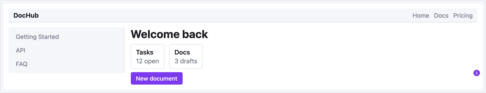
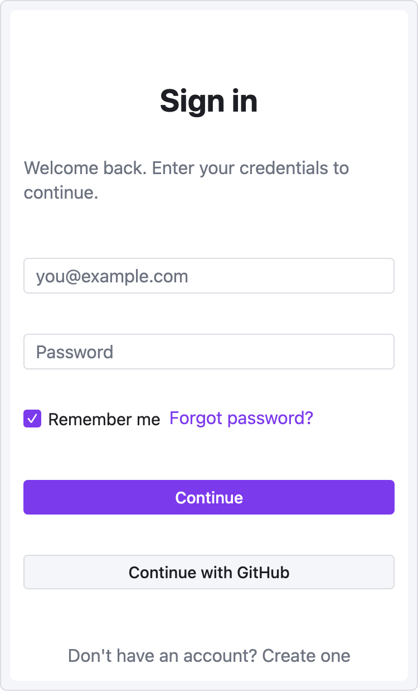
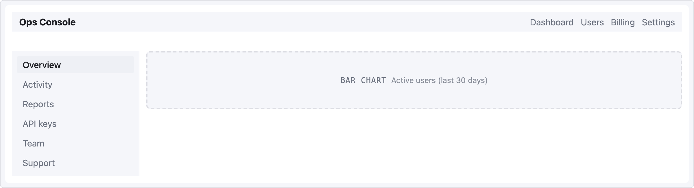

# UI Sketch

**Language:** English · [한국어](#한국어) · 📖 [Full docs](https://jkraccoon.github.io/obsidian-ui-sketch/) · [한국어 문서](./docs/ko/README.md)

[](./LICENSE)
[](https://obsidian.md)
[](https://github.com/sponsors/jkRaccoon)
[](./tests)

> **Sketch web UI wireframes from human-readable YAML — rendered inline in your Obsidian notes. 44 components. AI-friendly structure. Theme-adaptive.**
>
> **사람이 읽기 쉽고 AI가 다루기 좋은 YAML로 웹 UI 와이어프레임을 그려서 Obsidian 노트 안에 바로 렌더링합니다. 컴포넌트 44개. AI 친화 구조. 테마 자동 적응.**

---

## Why this exists

Product specs, design briefs, RFCs, kickoff docs — when planners and UI/UX designers describe a screen in markdown, they reach for ASCII boxes:

```text
+---------+------------------+
| Header  | Actions          |
+---------+------------------+
| Sidebar | Body             |
|         |                  |
+---------+------------------+
```

Slow to draw. Painful to edit. Easy to misalign. And worst of all, **the structure is gone the moment you type it out**. To your eyes it's a header with a sidebar; to anything trying to read it — a teammate skimming, a script parsing, an LLM rewriting — it's just `String.split('|')`.

That last reader matters more than ever. A growing share of product writing now happens with an AI in the loop: co-drafting the spec, asking the model to revise a layout, generating screen variants from a brief. **AI is excellent at reasoning over structured data and miserable at decoding ASCII rectangles.** Your spec ends up being two things at once — a picture humans can almost read, and a string the model can't understand. Neither audience is well served.

**UI Sketch is one simple trade.** Stop drawing the UI in text. Describe it in YAML instead:

```yaml
screen:
  - navbar: { brand: "DocHub" }
  - row:
      items:
        - col: { flex: 1, items: [ { sidebar: { items: ["Home", "Docs"] } } ] }
        - col: { flex: 3, items: [ { card: { title: "Welcome" } } ] }
```

One source. Three audiences:

- **Humans skim it in seconds.** YAML reads like an outline, not a maze of pipes and dashes. You can see the layout without rendering it.
- **AI consumes it as data.** Every screen, component, and prop is addressable. Models can mutate, validate, diff, generate variants — no decoding step.
- **Readers see a real wireframe.** Flip to reading view and the same YAML renders as a mid-fi frame, in your Obsidian theme. No mental reconstruction.

That's the whole pitch. Anywhere you'd otherwise reach for an ASCII sketch — spec docs, design briefs, RFCs, AI-assisted product threads — you get a single artifact that you, your reviewers, and your tools can all edit.



---

# English

## See it in action

Drop this in a ` ```ui-sketch ` fenced block, switch to Reading view, and the wireframe appears inline.

```yaml
viewport: desktop
screen:
  - navbar: { brand: "DocHub", items: ["Home", "Docs", "Pricing"] }
  - row:
      gap: 16
      items:
        - col:
            flex: 1
            items:
              - sidebar: { items: ["Getting Started", "API", "FAQ"] }
        - col:
            flex: 3
            items:
              - heading: { level: 1, text: "Welcome back" }
              - row:
                  gap: 12
                  items:
                    - card: { title: "Tasks", body: "12 open" }
                    - card: { title: "Docs",  body: "3 drafts" }
              - button:
                  label: "New document"
                  variant: primary
                  note: "Navigates to /documents/new"
```

A single `viewport:` key flips between desktop, tablet, and mobile:

<table>
<tr>
<td width="50%" valign="top">

**`viewport: mobile`** — a 375px login form ([recipe](./docs/recipes/login-form.md)):



</td>
<td width="50%" valign="top">

**`viewport: desktop`** — a named-area grid dashboard ([recipe](./docs/recipes/dashboard.md)):



</td>
</tr>
</table>

## What you trade ASCII for

| Pain | Before (ASCII) | After (UI Sketch) |
|---|---|---|
| Aligning columns | `│ Header │ Actions │` gymnastics | `- row: { items: [...] }` |
| Tweaking layout | Retype the entire diagram | Edit one line of YAML |
| Reading someone else's sketch | Decode what the boxes meant | Render it and see |
| Keeping vault consistent with theme | Manual color adjustments | Uses Obsidian CSS variables automatically |
| Asking an LLM to revise the layout | Paste an ambiguous picture | Paste structured YAML |

- **Mid-fi by design.** Not a Figma replacement — a *fast sketching* tool that lives in your notes.
- **Theme-adaptive.** Light, dark, and community themes inherit via `var(--interactive-accent)` and friends.
- **Friendly errors.** YAML typo? Red box with the exact line. Unknown component? Levenshtein-based suggestion.
- **Safe.** Depth and node-count caps prevent runaway blocks. The `raw:` escape hatch runs through `sanitize-html` — no XSS surface.
- **Zero runtime state.** Every render is a pure function from YAML to DOM. No surprises in Live Preview.

## Quick start

### 1. Install

**One-click from Obsidian Community (recommended)**:
1. Open the plugin page: **[community.obsidian.md/plugins/ui-sketch](https://community.obsidian.md/plugins/ui-sketch)**.
2. Click the **Add** button — Obsidian opens and installs UI Sketch automatically.
3. Enable **UI Sketch** under Settings → Community plugins.

**From inside Obsidian** — Settings → **Community plugins** → **Browse** → search `UI Sketch` → **Install** → enable.

**Pre-release / dev build (BRAT)**:
1. Install the [BRAT](https://github.com/TfTHacker/obsidian42-brat) community plugin.
2. BRAT → "Add Beta plugin" → `jkRaccoon/obsidian-ui-sketch`.
3. Enable **UI Sketch** in Community plugins.

**Manual install**:
1. Download `main.js`, `manifest.json`, and `styles.css` from [the latest release](https://github.com/jkRaccoon/obsidian-ui-sketch/releases). Release assets are signed with [GitHub artifact attestations](https://docs.github.com/en/actions/security-for-github-actions/using-artifact-attestations/using-artifact-attestations-to-establish-provenance-for-builds); verify with `gh attestation verify main.js --repo jkRaccoon/obsidian-ui-sketch`.
2. Copy them into `<your-vault>/.obsidian/plugins/ui-sketch/`.
3. Enable the plugin in Settings.

### 2. Write your first sketch

In any note, add a fenced code block tagged `ui-sketch`:

````markdown
```ui-sketch
screen:
  - navbar: { brand: "MyApp" }
  - button: { label: "Sign in", variant: primary }
```
````

Switch to Reading view (`Ctrl/Cmd+E`). You'll see a rendered wireframe.

### 3. Go deeper

Full documentation lives in [**`docs/`**](./docs/README.md):

- [Getting Started](./docs/getting-started.md) — a 5-minute tutorial
- [YAML Reference](./docs/yaml-reference.md) — complete syntax
- [Component Reference](./docs/components/README.md) — prop tables and examples for all 44 components
- [Recipes](./docs/recipes/dashboard.md) — copy-paste templates for common screens
- [Troubleshooting](./docs/troubleshooting.md) — error levels and common fixes

## Component catalog

**44 components in 8 categories, plus one escape hatch.** Every component accepts the base props (`id`, `w`, `h`, `align`, `pad`, `note`, `muted`) on top of its type-specific props. Detailed prop tables live in the [Component Reference](./docs/components/README.md).

| Category | Components |
|---|---|
| [**Layout structure**](./docs/components/layout.md) | `container` · `card` · `panel` · `divider` · `spacer` |
| [**Navigation**](./docs/components/navigation.md) | `navbar` · `sidebar` · `tabs` · `breadcrumb` · `pagination` · `stepper` |
| [**Basic input**](./docs/components/input-basic.md) | `button` · `input` · `textarea` · `select` · `checkbox` · `radio` |
| [**Advanced input**](./docs/components/input-advanced.md) | `toggle` · `slider` · `date-picker` · `file-upload` · `search` |
| [**Display**](./docs/components/display.md) | `heading` · `text` · `image` · `icon` · `avatar` · `badge` · `tag` · `kbd` |
| [**Feedback**](./docs/components/feedback.md) | `alert` · `progress` · `toast` · `modal` · `skeleton` |
| [**Data**](./docs/components/data.md) | `table` · `list` · `tree` · `kv-list` |
| [**Placeholder**](./docs/components/placeholder.md) | `chart` · `map` · `video` · `placeholder` |
| [**Escape hatch**](./docs/components/raw.md) | `raw` (sanitized HTML) |

A few examples:

```yaml
alert:
  severity: warn
  title: "Heads up"
  message: "Review before committing."

table:
  columns: ["Name", "Role", "Status"]
  rows:
    - ["Ada",  "PM",  "✓"]
    - ["Ben",  "ENG", "…"]

tree:
  items:
    - label: "src"
      children:
        - { label: "main.ts" }
        - { label: "types.ts" }
    - { label: "docs" }

kbd:
  keys: ["Ctrl", "K"]
```

## YAML structure

See the [**YAML Reference**](./docs/yaml-reference.md) for complete syntax. Quick overview:

```yaml
viewport: desktop | tablet | mobile | custom   # default: desktop (1200px)
width: 375                                      # custom only
height: 640                                     # custom only
theme: adaptive                                 # v0.2 only supports "adaptive"
background: default | muted | transparent
screen:                                         # required: array OR grid
  - ...
```

Two layout models, mutually exclusive at the root:

**Flex (row/col nesting)** — primary model, fits 99% of web UIs:

```yaml
screen:
  - row:
      gap: 12
      items:
        - col: { flex: 1, items: [ { sidebar: {...} } ] }
        - col: { flex: 3, items: [ ... ] }
```

**Named-area grid** — for dashboard layouts:

```yaml
screen:
  grid:
    areas:
      - "nav  nav  nav"
      - "side main main"
      - "side foot foot"
    cols: "180px 1fr 1fr"
    rows: "56px 1fr 48px"
    map:
      nav:  { navbar: { brand: "MyApp" } }
      side: { sidebar: { items: ["Home", "Docs"] } }
      main: { card:    { title: "Welcome" } }
      foot: { text:    { value: "© 2026" } }
```

## Error handling

UI Sketch never fails silently. Every problem gets surfaced with something actionable.

| Level | When | Result |
|---|---|---|
| **L1** YAML parse error | Malformed YAML | Full-block error box with line/col |
| **L2** Structure error | Missing `screen`, unknown viewport, etc. | Full-block error box with path |
| **L3** Component error | Unknown component type or invalid props | Inline error box at that component's position — rest of the wireframe still renders |
| **L4** Empty block | No content | Friendly placeholder with a starter example |

**Typo suggestions** (Levenshtein distance ≤ 2):

> ⚠ `butn`: unknown component type · Did you mean "button"?

**Safety caps**:
- Max tree depth: **32**
- Max node count: **5000 per block**
- `raw:` HTML always runs through `sanitize-html` — no `<script>`, no inline event handlers.

Common causes and fixes are in [**Troubleshooting**](./docs/troubleshooting.md).

## Settings

Open Settings → Community plugins → **UI Sketch**:

| Setting | Default | Notes |
|---|---|---|
| Default viewport | `desktop` | Applied to any block that omits `viewport:` |
| Default theme | `adaptive` | Locked in v0.2 |
| Compact mode | Off | Scales spacing and fonts by ×0.875 — useful when stacking several blocks in one note |

## Development

```bash
# Requires Node 18+
npm install

npm run dev        # esbuild watch mode
npm test           # vitest (happy-dom)
npm run lint       # eslint with obsidianmd/recommended ruleset
npm run typecheck  # tsc --noEmit
npm run build      # production bundle → main.js
```

Plugin files at repo root:
- `main.js` — bundled plugin
- `manifest.json` — plugin metadata for Obsidian
- `styles.css` — theme-adaptive styling

Source organized by responsibility:

```text
src/
├── main.ts                Plugin lifecycle, code-block processor
├── settings.ts            Settings tab + data model
├── types.ts               Shared AST types
├── parser/                YAML → document (+ location info)
├── schema/                Structural validation + per-component zod
├── components/            44 builtin components, each a single file
├── renderer/              Dispatches layout tree → DOM
├── styler/                Viewport frame, theme hooks
└── errors/                L1/L2/L3 error rendering
```

## Roadmap

- **v0.1** (released) — Foundation: 10 components, L1/L2/L4 errors, viewport frames.
- **v0.2** — 44 components, L3 inline errors + typo suggestions, safety caps, `raw:` + sanitize-html, zod schemas per component, auto-generated component docs, recipe screenshots, signed release workflow (GitHub artifact attestation), Obsidian Community directory submission.
- **v0.3** (current) — Adoption of the official [`eslint-plugin-obsidianmd`](https://github.com/obsidianmd/eslint-plugin) ruleset (createDiv/createSpan helpers, `activeDocument` for popout windows, stricter style/DOM hygiene).
- **Future ideas** — PNG/SVG export, multi-screen storyboards with connectors, reusable component definitions (partials), brand-color theme presets, an LLM-friendly OpenAPI schema for the YAML.

Design specs in [`docs/superpowers/specs/`](./docs/superpowers/specs/); implementation plans in [`docs/superpowers/plans/`](./docs/superpowers/plans/).

## Sponsor

If UI Sketch saves you time on your wireframes, consider **[sponsoring on GitHub](https://github.com/sponsors/jkRaccoon)**. Sponsorships fund time spent on this plugin and future Obsidian tools.

## Contributing

Issues and PRs welcome. For a bigger change, please open an issue first so we can talk through the design. Small fixes can go straight to a PR.

- **Found a bug?** Include the YAML block that reproduces it, the expected render, and what you actually got.
- **Want a new component?** Check the catalog first. If it's genuinely missing, open an issue with a minimal YAML example.
- **Styling tweaks?** Keep color/radius/spacing values as Obsidian CSS variables — no hard-coded colors.

---

# 한국어

## 왜 만들었나

기획서, 디자인 브리프, RFC, 킥오프 문서 — 기획자나 UI/UX 디자이너가 마크다운으로 화면을 설명할 때, 결국 ASCII 박스를 찾게 됩니다:

```text
+---------+------------------+
| 헤더    | 액션              |
+---------+------------------+
| 사이드바 | 본문              |
|         |                  |
+---------+------------------+
```

그리기 느립니다. 수정 고통스럽습니다. 정렬 어긋나기 일쑤입니다. 그리고 무엇보다도 **타이핑하는 순간 구조가 사라집니다**. 당신 눈에는 헤더와 사이드바지만, 그걸 읽는 무엇이든 — 훑어보는 동료, 파싱하는 스크립트, 다시 쓰는 LLM — 보기에는 그냥 `String.split('|')`일 뿐이죠.

이 마지막 독자가 요즘 점점 더 중요해지고 있습니다. 기획 글쓰기의 상당 부분이 이제 AI와 함께 이뤄집니다 — 모델과 스펙을 함께 다듬고, 레이아웃을 수정해달라고 하고, 브리프로부터 새 화면 안을 만들어내죠. **AI는 구조화된 데이터를 다루는 데 뛰어나지만 ASCII 사각형을 해독하는 건 못합니다.** 결과적으로 스펙은 두 가지가 동시에 됩니다 — 사람이 거의 읽을 수 있는 그림이자, 모델이 이해 못 하는 문자열. 두 독자 모두 제대로 대접받지 못하는 거죠.

**UI Sketch는 한 가지 단순한 거래입니다.** UI를 텍스트로 그리지 마세요. 대신 YAML로 설명하세요:

```yaml
screen:
  - navbar: { brand: "DocHub" }
  - row:
      items:
        - col: { flex: 1, items: [ { sidebar: { items: ["Home", "Docs"] } } ] }
        - col: { flex: 3, items: [ { card: { title: "Welcome" } } ] }
```

하나의 소스, 세 명의 독자:

- **사람은 몇 초 만에 파악합니다.** YAML은 파이프와 대시의 미로가 아니라 개요(outline)처럼 읽힙니다. 렌더링 없이도 레이아웃이 보입니다.
- **AI는 데이터로 소비합니다.** 화면, 컴포넌트, 프롭 하나하나가 주소 지정 가능합니다. 모델이 변형/검증/diff/생성 — 모두 해독 단계 없이 가능합니다.
- **독자는 진짜 와이어프레임을 봅니다.** 읽기 뷰로 전환하면 같은 YAML이 Obsidian 테마에 맞춰 mid-fi 프레임으로 렌더링됩니다. 머릿속 재구성 작업 없음.

이게 전부입니다. ASCII 스케치가 등장할 자리라면 어디든 — 기획서, 디자인 브리프, RFC, AI 협업 제품 스레드 — 당신과 리뷰어와 도구가 모두 함께 편집할 수 있는 단일 산출물이 됩니다.

## 직접 보기

아래 YAML을 ` ```ui-sketch ` 코드 블록 안에 넣고 읽기 뷰로 전환하면, 노트 안에서 와이어프레임이 바로 렌더링됩니다.

```yaml
viewport: desktop
screen:
  - navbar: { brand: "DocHub", items: ["Home", "Docs", "Pricing"] }
  - row:
      gap: 16
      items:
        - col:
            flex: 1
            items:
              - sidebar: { items: ["Getting Started", "API", "FAQ"] }
        - col:
            flex: 3
            items:
              - heading: { level: 1, text: "Welcome back" }
              - row:
                  gap: 12
                  items:
                    - card: { title: "Tasks", body: "12 open" }
                    - card: { title: "Docs",  body: "3 drafts" }
              - button:
                  label: "New document"
                  variant: primary
                  note: "Navigates to /documents/new"
```

`viewport:` 한 줄로 데스크톱부터 모바일까지 전환됩니다:

<table>
<tr>
<td width="50%" valign="top">

**`viewport: mobile`** — 375px 로그인 폼 ([레시피](./docs/ko/recipes/login-form.md)):


</td>
<td width="50%" valign="top">

**`viewport: desktop`** — named-area 그리드 대시보드 ([레시피](./docs/ko/recipes/dashboard.md)):


</td>
</tr>
</table>

## ASCII와 맞바꾸는 것

| 고통 | 이전 (ASCII) | 이후 (UI Sketch) |
|---|---|---|
| 열 맞추기 | `│ Header │ Actions │` 체조 | `- row: { items: [...] }` |
| 레이아웃 조정 | 다이어그램 전체 재작성 | YAML 한 줄 수정 |
| 다른 사람 스케치 읽기 | 박스가 뭘 의미하는지 해독 | 렌더링해서 그대로 봄 |
| 테마 일관성 유지 | 수동 색상 조정 | Obsidian CSS 변수로 자동 |
| AI에게 레이아웃 수정 요청 | 모호한 그림 붙여넣기 | 구조화된 YAML 붙여넣기 |

- **중간 충실도가 기본.** Figma 대체재가 아니라, 노트 안에서 쓰는 *빠른 스케치 도구*입니다.
- **테마 자동 적용.** 라이트, 다크, 커뮤니티 테마 모두 `var(--interactive-accent)` 같은 변수로 자동 상속합니다.
- **친절한 에러.** YAML 오타? 줄 번호와 함께 빨간 박스를 띄웁니다. 컴포넌트 이름 틀림? Levenshtein 기반으로 가장 가까운 이름을 제안합니다.
- **안전함.** 깊이/노드 수 제한으로 폭주 방지. `raw:` 탈출구는 `sanitize-html`을 거치므로 XSS 우려 없음.
- **런타임 상태 없음.** 매 렌더링은 YAML → DOM 순수 함수. 라이브 프리뷰에서 놀랄 일 없습니다.

## 빠른 시작

### 1. 설치

**Obsidian Community 페이지에서 한 번에 설치 (권장)**:
1. 플러그인 페이지 열기: **[community.obsidian.md/plugins/ui-sketch](https://community.obsidian.md/plugins/ui-sketch)**.
2. **추가(Add)** 버튼 클릭 — Obsidian이 열리고 UI Sketch가 자동으로 설치됩니다.
3. 설정 → 커뮤니티 플러그인에서 **UI Sketch** 활성화.

**Obsidian 안에서 직접** — 설정 → **커뮤니티 플러그인** → **둘러보기** → `UI Sketch` 검색 → **설치** → 활성화.

**프리릴리스 / 개발 빌드 (BRAT)**:
1. [BRAT](https://github.com/TfTHacker/obsidian42-brat) 커뮤니티 플러그인 설치.
2. BRAT → "Add Beta plugin" → `jkRaccoon/obsidian-ui-sketch`.
3. 커뮤니티 플러그인에서 **UI Sketch** 활성화.

**수동 설치**:
1. [최신 릴리스](https://github.com/jkRaccoon/obsidian-ui-sketch/releases)에서 `main.js`, `manifest.json`, `styles.css` 다운로드. 릴리스 자산은 [GitHub artifact attestation](https://docs.github.com/en/actions/security-for-github-actions/using-artifact-attestations/using-artifact-attestations-to-establish-provenance-for-builds)으로 서명되어 있어, `gh attestation verify main.js --repo jkRaccoon/obsidian-ui-sketch` 명령으로 출처 검증이 가능합니다.
2. `<your-vault>/.obsidian/plugins/ui-sketch/`에 복사.
3. 설정에서 플러그인 활성화.

### 2. 첫 스케치 작성

아무 노트에 `ui-sketch` 태그 코드 블록을 추가:

````markdown
```ui-sketch
screen:
  - navbar: { brand: "MyApp" }
  - button: { label: "Sign in", variant: primary }
```
````

읽기 뷰로 전환 (`Ctrl/Cmd+E`). 와이어프레임이 보입니다.

### 3. 더 들어가기

전체 한국어 문서는 [**`docs/ko/`**](./docs/ko/README.md)에 있습니다:

- [시작하기](./docs/ko/getting-started.md) — 5분 튜토리얼
- [YAML 레퍼런스](./docs/ko/yaml-reference.md) — 전체 문법
- [컴포넌트 레퍼런스](./docs/ko/components/README.md) — 44개 컴포넌트의 프롭 표와 예제
- [레시피](./docs/ko/recipes/dashboard.md) — 자주 쓰는 화면 템플릿
- [문제 해결](./docs/ko/troubleshooting.md) — 에러 레벨과 대응법

## 컴포넌트 카탈로그

**8개 카테고리 44개 컴포넌트 + 탈출구 하나.** 모든 컴포넌트는 타입별 프롭 위에 공통 프롭(`id`, `w`, `h`, `align`, `pad`, `note`, `muted`)을 받습니다. 상세 프롭 표는 [컴포넌트 레퍼런스](./docs/ko/components/README.md) 참고.

| 카테고리 | 컴포넌트 |
|---|---|
| [**레이아웃**](./docs/ko/components/layout.md) | `container` · `card` · `panel` · `divider` · `spacer` |
| [**내비게이션**](./docs/ko/components/navigation.md) | `navbar` · `sidebar` · `tabs` · `breadcrumb` · `pagination` · `stepper` |
| [**기본 입력**](./docs/ko/components/input-basic.md) | `button` · `input` · `textarea` · `select` · `checkbox` · `radio` |
| [**고급 입력**](./docs/ko/components/input-advanced.md) | `toggle` · `slider` · `date-picker` · `file-upload` · `search` |
| [**표시**](./docs/ko/components/display.md) | `heading` · `text` · `image` · `icon` · `avatar` · `badge` · `tag` · `kbd` |
| [**피드백**](./docs/ko/components/feedback.md) | `alert` · `progress` · `toast` · `modal` · `skeleton` |
| [**데이터**](./docs/ko/components/data.md) | `table` · `list` · `tree` · `kv-list` |
| [**플레이스홀더**](./docs/ko/components/placeholder.md) | `chart` · `map` · `video` · `placeholder` |
| [**탈출구**](./docs/ko/components/raw.md) | `raw` (sanitize된 HTML) |

예시 몇 가지:

```yaml
alert:
  severity: warn
  title: "Heads up"
  message: "Review before committing."

table:
  columns: ["Name", "Role", "Status"]
  rows:
    - ["Ada",  "PM",  "✓"]
    - ["Ben",  "ENG", "…"]

tree:
  items:
    - label: "src"
      children:
        - { label: "main.ts" }
        - { label: "types.ts" }
    - { label: "docs" }

kbd:
  keys: ["Ctrl", "K"]
```

## YAML 구조

전체 문법은 [**YAML 레퍼런스**](./docs/ko/yaml-reference.md) 참고. 간단 개요:

```yaml
viewport: desktop | tablet | mobile | custom   # 기본값: desktop (1200px)
width: 375                                      # custom일 때만
height: 640                                     # custom일 때만
theme: adaptive                                 # v0.2는 "adaptive"만 지원
background: default | muted | transparent
screen:                                         # 필수: 배열 OR grid
  - ...
```

두 가지 레이아웃 모델 (최상위에서 상호 배타):

**Flex (row/col 중첩)** — 기본 모델, 웹 UI 99% 커버:

```yaml
screen:
  - row:
      gap: 12
      items:
        - col: { flex: 1, items: [ { sidebar: {...} } ] }
        - col: { flex: 3, items: [ ... ] }
```

**Named-area grid** — 대시보드 레이아웃용:

```yaml
screen:
  grid:
    areas:
      - "nav  nav  nav"
      - "side main main"
      - "side foot foot"
    cols: "180px 1fr 1fr"
    rows: "56px 1fr 48px"
    map:
      nav:  { navbar: { brand: "MyApp" } }
      side: { sidebar: { items: ["Home", "Docs"] } }
      main: { card:    { title: "Welcome" } }
      foot: { text:    { value: "© 2026" } }
```

## 에러 처리

UI Sketch는 조용히 실패하지 않습니다. 항상 대응 가능한 메시지를 보여줍니다.

| 레벨 | 상황 | 결과 |
|---|---|---|
| **L1** YAML 파싱 에러 | 문법 오류 | 블록 전체 에러 박스 + 줄/열 |
| **L2** 구조 에러 | `screen` 누락, 알 수 없는 viewport 등 | 블록 전체 에러 박스 + 경로 |
| **L3** 컴포넌트 에러 | 알 수 없는 컴포넌트 타입 또는 잘못된 프롭 | 해당 위치에 인라인 에러 박스 — 나머지는 정상 렌더링 |
| **L4** 빈 블록 | 내용 없음 | 친절한 플레이스홀더 + 예시 코드 |

**오타 제안** (Levenshtein 거리 ≤ 2):

> ⚠ `butn`: unknown component type · Did you mean "button"?

**안전 제한**:
- 최대 트리 깊이: **32**
- 최대 노드 수: **블록당 5000**
- `raw:` HTML은 항상 `sanitize-html`을 통과 — `<script>` 불가, 인라인 이벤트 핸들러 불가.

자주 마주치는 문제와 해결법은 [**문제 해결**](./docs/ko/troubleshooting.md) 참고.

## 설정

설정 → 커뮤니티 플러그인 → **UI Sketch**:

| 항목 | 기본값 | 비고 |
|---|---|---|
| 기본 viewport | `desktop` | `viewport:` 생략한 블록에 적용 |
| 기본 theme | `adaptive` | v0.2에서는 고정 |
| Compact 모드 | 꺼짐 | 간격과 폰트를 ×0.875로 축소 — 한 노트에 블록 여러 개 쌓을 때 유용 |

## 개발

```bash
# Node 18+ 필요
npm install

npm run dev        # esbuild watch 모드
npm test           # vitest (happy-dom)
npm run lint       # obsidianmd/recommended 룰셋으로 eslint
npm run typecheck  # tsc --noEmit
npm run build      # 프로덕션 번들 → main.js
```

저장소 루트 플러그인 파일:
- `main.js` — 번들된 플러그인
- `manifest.json` — Obsidian 플러그인 메타데이터
- `styles.css` — 테마 적응형 스타일

책임별로 구성된 소스:

```text
src/
├── main.ts                플러그인 생명주기, 코드 블록 프로세서
├── settings.ts            설정 탭 + 데이터 모델
├── types.ts               공용 AST 타입
├── parser/                YAML → document (+ 위치 정보)
├── schema/                구조 검증 + 컴포넌트별 zod
├── components/            내장 컴포넌트 44개, 각각 파일 하나
├── renderer/              레이아웃 트리 → DOM 디스패치
├── styler/                viewport 프레임, 테마 훅
└── errors/                L1/L2/L3 에러 렌더링
```

## 로드맵

- **v0.1** (릴리스됨) — 기반: 10개 컴포넌트, L1/L2/L4 에러, viewport 프레임.
- **v0.2** — 컴포넌트 총 44개, L3 인라인 에러 + 오타 제안, 안전 제한, `raw:` + sanitize-html, 컴포넌트별 zod 스키마, 자동 생성 컴포넌트 문서, 레시피 스크린샷, 서명된 릴리스 워크플로우(GitHub artifact attestation), Obsidian Community 디렉토리 등록.
- **v0.3** (현재) — 공식 [`eslint-plugin-obsidianmd`](https://github.com/obsidianmd/eslint-plugin) 룰셋 적용 (createDiv/createSpan 헬퍼, 팝아웃 창 호환을 위한 `activeDocument`, 더 엄격한 스타일/DOM 규칙).
- **이후 아이디어** — PNG/SVG 내보내기, 커넥터가 있는 다중 화면 스토리보드, 재사용 가능한 컴포넌트 정의 (partial), 브랜드 컬러 테마 프리셋, LLM 친화 OpenAPI 스키마.

설계 스펙은 [`docs/superpowers/specs/`](./docs/superpowers/specs/), 구현 플랜은 [`docs/superpowers/plans/`](./docs/superpowers/plans/) 참고.

## 후원

UI Sketch가 와이어프레임 시간을 아껴준다면 **[GitHub 후원](https://github.com/sponsors/jkRaccoon)**을 고려해주세요. 후원은 이 플러그인과 향후 Obsidian 도구 개발 시간으로 쓰입니다.

## 기여

이슈와 PR 환영합니다. 큰 변경은 디자인을 논의할 수 있도록 먼저 이슈를 열어주세요. 작은 수정은 바로 PR 주셔도 됩니다.

- **버그 발견?** 재현 가능한 YAML 블록, 기대한 결과, 실제 결과를 함께 올려주세요.
- **새 컴포넌트 제안?** 먼저 카탈로그를 확인하세요. 정말 없다면 최소 YAML 예시와 함께 이슈 열어주세요.
- **스타일 수정?** 모든 색상/반경/간격은 Obsidian CSS 변수로 유지 — 하드코딩된 색 금지.

---

## License

[MIT](./LICENSE) © 2026 jikwangkim

Built with TypeScript, [esbuild](https://esbuild.github.io/), [zod](https://zod.dev/), [js-yaml](https://github.com/nodeca/js-yaml), [sanitize-html](https://github.com/apostrophecms/sanitize-html), and [Vitest](https://vitest.dev/) · [happy-dom](https://github.com/capricorn86/happy-dom). Linted with [`eslint-plugin-obsidianmd`](https://github.com/obsidianmd/eslint-plugin).
