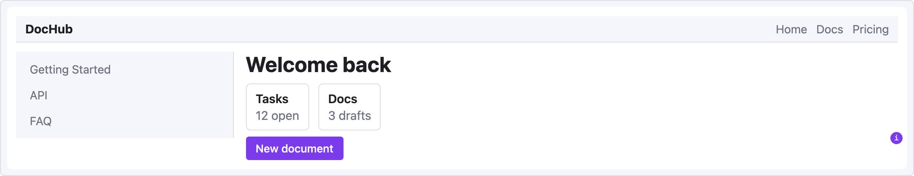

# UI Sketch 문서

**[English](../README.md) · 한국어**

UI Sketch Obsidian 플러그인의 사용자 문서 — 짧은 YAML 블록에서 중간 충실도 웹 UI 와이어프레임을 Obsidian 노트 안에 바로 렌더링합니다. 설치와 개요는 [메인 README](https://github.com/jkRaccoon/obsidian-ui-sketch/blob/main/README.ko.md) 참고.

## 섹션

- **[시작하기](./getting-started.md)** — 5분 튜토리얼.
- **[YAML 레퍼런스](./yaml-reference.md)** — 전체 문법: viewport, screen, row/col, grid, 공통 프롭.
- **[컴포넌트 레퍼런스](./components/README.md)** — 44개 컴포넌트 전체를 카테고리별로, 프롭 표와 예제 포함.
- **레시피** — 자주 쓰는 레이아웃의 복사-붙여넣기 템플릿:
  - [대시보드](./recipes/dashboard.md) — grid 기반 관리 화면
  - [로그인 폼](./recipes/login-form.md) — 중앙 정렬 모바일 폼
  - [설정 패널](./recipes/settings-panel.md) — 2컬럼 설정 화면
- **[문제 해결](./troubleshooting.md)** — 에러 레벨별 대응법, 자주 하는 실수, FAQ.

## 버전 관리

이 문서는 플러그인 버전과 함께 관리됩니다. 프롭이나 컴포넌트가 문서와 다르게 동작한다면 `manifest.json`을 확인하세요 — `main` 브랜치의 문서는 GitHub의 최신 릴리스를 반영합니다.

## 설계 문서

내부 설계 스펙과 구현 계획은 [`../superpowers/`](../superpowers/)(영문) 참고. 사용자용이 아니라 플러그인이 어떻게 만들어졌는지 기록한 것입니다.
