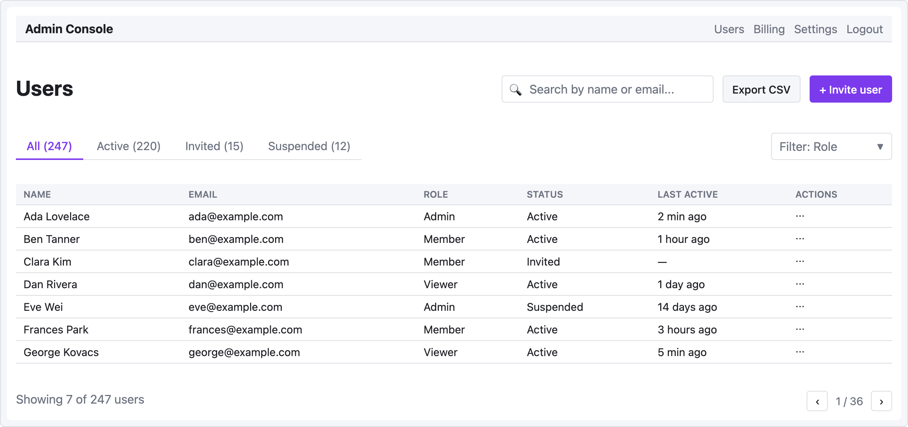

# 레시피 — 관리자 표

검색, 필터 탭, 데이터 표, 페이지네이션이 있는 사용자 관리 화면. 가장 흔한 관리 UI 패턴 중 하나.

```ui-sketch
viewport: desktop
screen:
  - navbar:
      brand: "Admin Console"
      items: ["Users", "Billing", "Settings", "Logout"]
  - spacer: { size: 20 }
  - row:
      gap: 12
      align: center
      items:
        - heading: { level: 1, text: "Users" }
        - col: { flex: 1, items: [] }
        - search: { placeholder: "Search by name or email...", w: 280 }
        - button: { label: "Export CSV", variant: secondary }
        - button: { label: "+ Invite user", variant: primary }
  - spacer: { size: 16 }
  - row:
      gap: 12
      align: center
      items:
        - tabs:
            items: ["All (247)", "Active (220)", "Invited (15)", "Suspended (12)"]
            active: 0
        - col: { flex: 1, items: [] }
        - select:
            placeholder: "Filter: Role"
            options: ["All roles", "Admin", "Member", "Viewer"]
            w: 160
  - spacer: { size: 8 }
  - table:
      columns: ["Name", "Email", "Role", "Status", "Last active", "Actions"]
      rows:
        - ["Ada Lovelace",    "ada@example.com",    "Admin",   "Active",     "2 min ago",   "⋯"]
        - ["Ben Tanner",      "ben@example.com",    "Member",  "Active",     "1 hour ago",  "⋯"]
        - ["Clara Kim",       "clara@example.com",  "Member",  "Invited",    "—",           "⋯"]
        - ["Dan Rivera",      "dan@example.com",    "Viewer",  "Active",     "1 day ago",   "⋯"]
        - ["Eve Wei",         "eve@example.com",    "Admin",   "Suspended",  "14 days ago", "⋯"]
        - ["Frances Park",    "frances@example.com","Member",  "Active",     "3 hours ago", "⋯"]
        - ["George Kovacs",   "george@example.com", "Viewer",  "Active",     "5 min ago",   "⋯"]
  - spacer: { size: 12 }
  - row:
      gap: 12
      align: center
      items:
        - text: { value: "Showing 7 of 247 users", tone: muted }
        - col: { flex: 1, items: [] }
        - pagination: { current: 1, total: 36 }
```



## 패턴 메모

- **액션 바 레이아웃** — 왼쪽 heading, 오른쪽 액션, 사이에 `col { flex: 1 }` 이 공간 흡수. 세 액션(검색, 내보내기, 초대)이 오른쪽에 묶여 유지됨.
- **카운트 있는 필터 탭** — 탭 라벨에 카운트(`"All (247)"`) 포함으로 한눈에 상태 파악. 역할 필터는 탭 row 오른쪽에 별도.
- 표의 **Actions 컬럼**에 `⋯` 로 "row 메뉴 열기" 버튼을 mid-fi 플레이스홀더로 표시. 고충실도 디자인에선 실제 아이콘 필요.
- **페이지네이션 푸터**도 같은 flex 스페이서 관용구로 카운트 + 페이지 네비게이션 분리.
