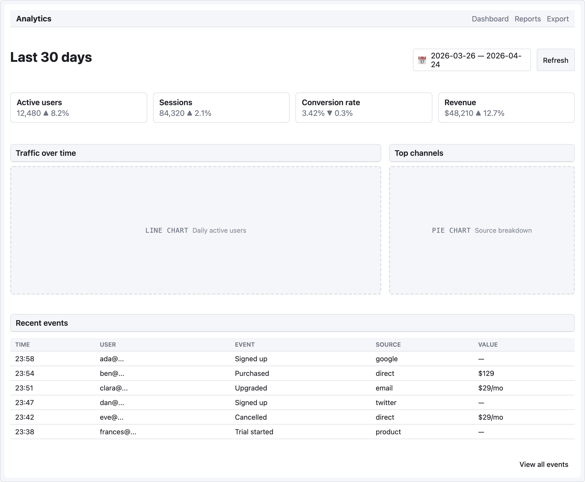

# 레시피 — 애널리틱스 대시보드

상단 KPI 카드, 아래 차트 플레이스홀더, 하단 최근 이벤트 표. "한눈에 보기" 뷰.

```ui-sketch
viewport: desktop
screen:
  - navbar:
      brand: "Analytics"
      items: ["Dashboard", "Reports", "Export"]
  - spacer: { size: 20 }
  - row:
      gap: 12
      align: center
      items:
        - heading: { level: 1, text: "Last 30 days" }
        - col: { flex: 1, items: [] }
        - date-picker: { value: "2026-03-26 — 2026-04-24", w: 220 }
        - button: { label: "Refresh", variant: secondary }
  - spacer: { size: 20 }
  - row:
      gap: 12
      items:
        - col:
            flex: 1
            items:
              - card:
                  title: "Active users"
                  body: "12,480   ▲ 8.2%"
        - col:
            flex: 1
            items:
              - card:
                  title: "Sessions"
                  body: "84,320   ▲ 2.1%"
        - col:
            flex: 1
            items:
              - card:
                  title: "Conversion rate"
                  body: "3.42%   ▼ 0.3%"
        - col:
            flex: 1
            items:
              - card:
                  title: "Revenue"
                  body: "$48,210   ▲ 12.7%"
  - spacer: { size: 20 }
  - row:
      gap: 16
      items:
        - col:
            flex: 2
            items:
              - panel: { header: "Traffic over time" }
              - chart: { kind: line, label: "Daily active users", h: 260 }
        - col:
            flex: 1
            items:
              - panel: { header: "Top channels" }
              - chart: { kind: pie, label: "Source breakdown", h: 260 }
  - spacer: { size: 16 }
  - panel: { header: "Recent events" }
  - table:
      columns: ["Time", "User", "Event", "Source", "Value"]
      rows:
        - ["23:58", "ada@...",    "Signed up",     "google",   "—"]
        - ["23:54", "ben@...",    "Purchased",     "direct",   "$129"]
        - ["23:51", "clara@...",  "Upgraded",      "email",    "$29/mo"]
        - ["23:47", "dan@...",    "Signed up",     "twitter",  "—"]
        - ["23:42", "eve@...",    "Cancelled",     "direct",   "$29/mo"]
        - ["23:38", "frances@...", "Trial started", "product",  "—"]
  - spacer: { size: 12 }
  - row:
      items:
        - col: { flex: 1, items: [] }
        - button: { label: "View all events", variant: ghost }
```



## 패턴 메모

- **KPI 카드가 4 × `col { flex: 1 }`** — 클래식한 "한눈에 메트릭" row. 값 + 델타 인디케이터(`▲ 8.2%` / `▼ 0.3%`) 를 body 에 섞어 표시.
- **차트 2:1 비율** — 라인 차트(주)는 2 지분, 파이 차트(보조)는 1 지분. 둘 다 각자 `panel` 로 시각적으로 묶음.
- **차트 플레이스홀더**가 `kind:` 힌트(`bar` / `line` / `pie`) 로 실루엣 형성. mid-fi 목적에 충분; 구현에선 실제 차트 라이브러리로 업그레이드.
- 상단 액션 바 **`date-picker`** 는 현재 필터 범위를 리터럴 텍스트로 — mid-fi 패턴, 실제 picker 동작 없음.
