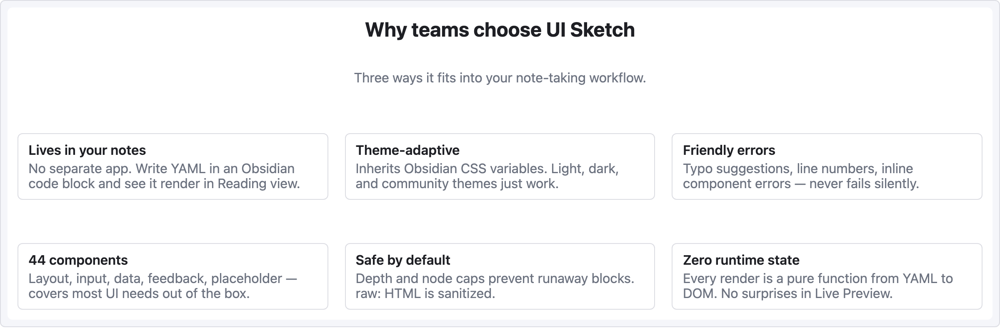

# 레시피 — 카드 그리드

3열 기능/제품 카드. 랜딩 페이지 피처 섹션, 제품 카탈로그, 팀 멤버 목록 등에 잘 어울림.

```ui-sketch
viewport: desktop
screen:
  - heading:
      level: 2
      text: "Why teams choose UI Sketch"
      align: center
  - spacer: { size: 8 }
  - text:
      value: "Three ways it fits into your note-taking workflow."
      tone: muted
      align: center
  - spacer: { size: 32 }
  - row:
      gap: 20
      items:
        - col:
            flex: 1
            items:
              - card:
                  title: "Lives in your notes"
                  body: "No separate app. Write YAML in an Obsidian code block and see it render in Reading view."
        - col:
            flex: 1
            items:
              - card:
                  title: "Theme-adaptive"
                  body: "Inherits Obsidian CSS variables. Light, dark, and community themes just work."
        - col:
            flex: 1
            items:
              - card:
                  title: "Friendly errors"
                  body: "Typo suggestions, line numbers, inline component errors — never fails silently."
  - spacer: { size: 28 }
  - row:
      gap: 20
      items:
        - col:
            flex: 1
            items:
              - card:
                  title: "44 components"
                  body: "Layout, input, data, feedback, placeholder — covers most UI needs out of the box."
        - col:
            flex: 1
            items:
              - card:
                  title: "Safe by default"
                  body: "Depth and node caps prevent runaway blocks. raw: HTML is sanitized."
        - col:
            flex: 1
            items:
              - card:
                  title: "Zero runtime state"
                  body: "Every render is a pure function from YAML to DOM. No surprises in Live Preview."
```



## 패턴 메모

- `col { flex: 1 }` 세 개가 카드 너비를 동등하게 만듦 — flex-grow 비율이 row 를 균등 분할.
- 두 번째 카드 row는 별도 `row` 항목 — 여러 줄 래핑은 수동 (auto-wrap grid 없음).
- 긴 카드 본문이 해당 row 안 모든 카드 높이를 맞추는 건 브라우저 기본 동작. 엄격한 높이를 원하면 각 카드에 `h:` 지정.
