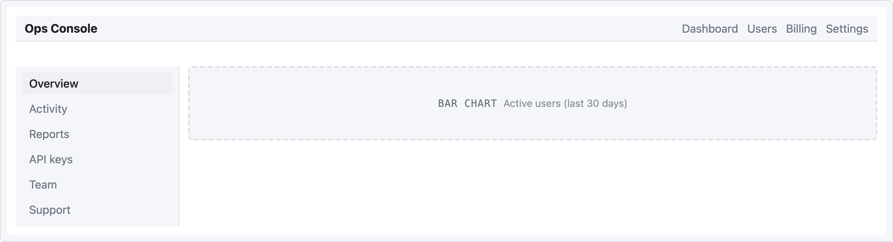
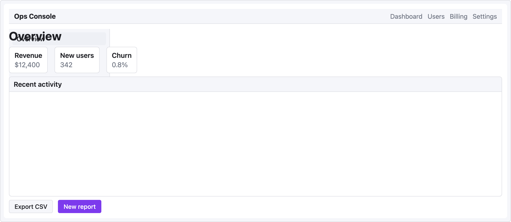

# 레시피 — 관리자 대시보드

클래식한 3영역 레이아웃: 상단 navbar, 좌측 sidebar, 카드와 표가 있는 메인 콘텐츠. 구조적 명확성을 위해 [`grid` 레이아웃](../yaml-reference.md#named-area-grid)을 사용.

```ui-sketch
viewport: desktop
screen:
  grid:
    areas:
      - "nav  nav  nav"
      - "side main main"
      - "side main main"
    cols: "220px 1fr 1fr"
    rows: "56px 1fr 1fr"
    map:
      nav:
        navbar:
          brand: "Ops Console"
          items: ["Dashboard", "Users", "Billing", "Settings"]
      side:
        sidebar:
          items: ["Overview", "Activity", "Reports", "API keys", "Team", "Support"]
          active: "Overview"
      main:
        container:
          pad: 24
```



`main` 셀에 여러 개를 실제로 채우려면 `container`를 단일 컴포넌트로 바꾸거나, grid 대신 flex 모델로 `main` 영역 안에 `col`을 중첩하세요.

## Flex 변형 (더 계층화된 콘텐츠)

메인 영역 안에서 진짜 중첩이 필요하면 flex 모델이 더 잘 확장됩니다:

```ui-sketch
viewport: desktop
screen:
  - navbar:
      brand: "Ops Console"
      items: ["Dashboard", "Users", "Billing", "Settings"]
  - row:
      gap: 0
      items:
        - col:
            flex: 0
            items:
              - sidebar:
                  w: 220
                  items: ["Overview", "Activity", "Reports", "API keys"]
                  active: "Overview"
        - col:
            flex: 1
            items:
              - heading: { level: 1, text: "Overview" }
              - row:
                  gap: 16
                  items:
                    - card: { title: "Revenue",   body: "$12,400" }
                    - card: { title: "New users", body: "342" }
                    - card: { title: "Churn",     body: "0.8%" }
              - panel:
                  header: "Recent activity"
                  h: 280
              - row:
                  gap: 12
                  items:
                    - button: { label: "Export CSV", variant: secondary }
                    - button: { label: "New report", variant: primary }
```



## 어느 쪽을 언제 쓸까

- **Grid** — 레이아웃이 고정이고, 영역에 이름이 있고, 정확한 컬럼/행이 중요할 때.
- **Flex (row/col)** — 콘텐츠가 유기적으로 자라고, 1:3 같은 비율을 원하고, 깊게 중첩하기 쉬움.

진짜 grid 모양 데이터 레이아웃(예: 4×3 메트릭 그리드)이 아닌 한, 대부분의 대시보드는 상단 navbar + flex로 더 깔끔하게 나옵니다.
