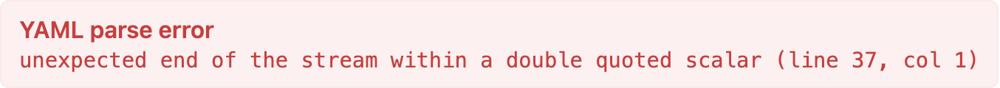

# 레시피 — 문서 사이트

브레드크럼, 접히는 사이드바, 메인 콘텐츠, 페이지 내 목차가 있는 문서 사이트 레이아웃. 메타 예시 — UI Sketch 문서 자체도 이런 식으로 스케치할 수 있음.

```ui-sketch
viewport: desktop
screen:
  - navbar:
      brand: "UI Sketch Docs"
      items: ["Home", "Reference", "Recipes", "GitHub", "v0.2.2"]
  - row:
      gap: 0
      items:
        - col:
            flex: 0
            items:
              - sidebar:
                  w: 240
                  items:
                    - "Getting Started"
                    - "YAML Reference"
                    - "Components"
                    - "Recipes"
                    - "Troubleshooting"
                    - "Changelog"
                  active: "Recipes"
        - col:
            flex: 3
            items:
              - container:
                  pad: 24
              - breadcrumb: { items: ["Docs", "Recipes", "Dashboard"] }
              - spacer: { size: 12 }
              - heading: { level: 1, text: "Dashboard" }
              - spacer: { size: 8 }
              - text:
                  value: "Classic three-area layout with navbar, sidebar, and main content — grid and flex variants."
                  tone: muted
              - spacer: { size: 20 }
              - panel: { header: "Example" }
              - placeholder: { label: "```ui-sketch code block here...", h: 180 }
              - spacer: { size: 16 }
              - heading: { level: 3, text: "Pattern notes" }
              - list:
                  items:
                    - "Grid is fixed layout — named areas, exact columns/rows"
                    - "Flex scales better for growing content"
                    - "col{flex:0} keeps sidebar width constant"
                    - "note: surfaces design rationale as tooltip"
              - spacer: { size: 16 }
              - heading: { level: 3, text: "When to use which" }
              - text:
                  value: "Grid for dashboards where layout is explicitly mapped. Flex when content grows or shrinks."
        - col:
            flex: 1
            items:
              - container:
                  pad: 16
              - text: { value: "On this page", tone: muted }
              - spacer: { size: 6 }
              - list:
                  items:
                    - "Example"
                    - "Pattern notes"
                    - "When to use which"
                    - "Variations"
```



## 패턴 메모

- 세 컬럼 — 사이드바(240 고정), 메인 콘텐츠(flex 3), 목차(flex 1). 메인:목차 3:1 비율로 콘텐츠 우선, 목차는 좁지만 보이게.
- `placeholder` 는 아직 다 스케치하지 않은 동적 요소(코드 블록, 차트) 를 표현할 때 이상적.
- navbar 의 버전 번호(`"v0.2.2"`)는 items 배열의 리터럴 텍스트 — 문서 사이트 헤더에 유용.
