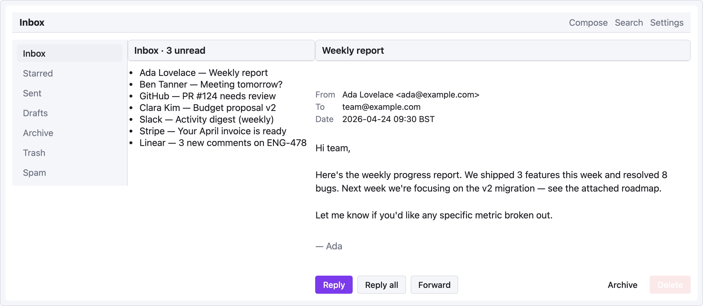

# 레시피 — 이메일 클라이언트

3 패널 받은 편지함: 왼쪽 탐색 레일, 가운데 메시지 목록, 오른쪽 열린 메시지. `row` → `col` 중첩 구조와 비율 기반 컬럼 너비를 보여줌.

```ui-sketch
viewport: desktop
screen:
  - navbar:
      brand: "Inbox"
      items: ["Compose", "Search", "Settings"]
  - row:
      gap: 0
      items:
        - col:
            flex: 0
            items:
              - sidebar:
                  w: 180
                  items:
                    ["Inbox", "Starred", "Sent", "Drafts", "Archive", "Trash", "Spam"]
                  active: "Inbox"
        - col:
            flex: 1
            items:
              - panel: { header: "Inbox · 3 unread" }
              - list:
                  items:
                    - "Ada Lovelace — Weekly report"
                    - "Ben Tanner — Meeting tomorrow?"
                    - "GitHub — PR #124 needs review"
                    - "Clara Kim — Budget proposal v2"
                    - "Slack — Activity digest (weekly)"
                    - "Stripe — Your April invoice is ready"
                    - "Linear — 3 new comments on ENG-478"
        - col:
            flex: 2
            items:
              - panel: { header: "Weekly report" }
              - container:
                  pad: 16
              - kv-list:
                  items:
                    - ["From", "Ada Lovelace <ada@example.com>"]
                    - ["To",   "team@example.com"]
                    - ["Date", "2026-04-24  09:30 BST"]
              - spacer: { size: 14 }
              - text:
                  value: "Hi team,"
              - spacer: { size: 8 }
              - text:
                  value: "Here's the weekly progress report. We shipped 3 features this week and resolved 8 bugs. Next week we're focusing on the v2 migration — see the attached roadmap."
              - spacer: { size: 8 }
              - text:
                  value: "Let me know if you'd like any specific metric broken out."
              - spacer: { size: 14 }
              - text: { value: "— Ada", tone: muted }
              - spacer: { size: 24 }
              - row:
                  gap: 8
                  items:
                    - button: { label: "Reply", variant: primary }
                    - button: { label: "Reply all", variant: secondary }
                    - button: { label: "Forward", variant: secondary }
                    - col: { flex: 1, items: [] }
                    - button: { label: "Archive", variant: ghost }
                    - button: { label: "Delete", variant: danger }
```



## 패턴 메모

- 세 컬럼의 `flex: 0 / 1 / 2` → 사이드바는 180px 고정, 목록은 1 지분, 읽기 창은 남은 공간의 2 지분.
- 하단 액션 바는 좌측 그룹(Reply / Reply all / Forward) + 우측 그룹(Archive / Delete) 을 중간 `col { flex: 1 }` 스페이서로 분리 — space-between 관용구.
- 바깥 row 의 `gap: 0` 으로 컬럼 간격 제거 → 패널이 붙어서 실제 멀티 페인 앱에 가까워짐.
