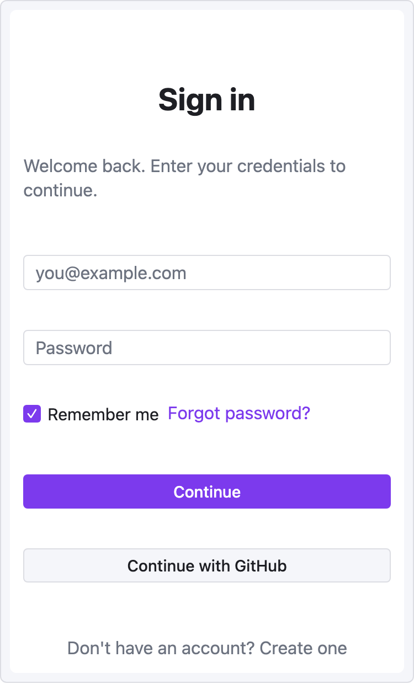
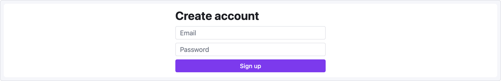

# 레시피 — 로그인 폼

중앙 정렬된 모바일 너비 폼. `mobile` viewport, 수직 쌓기, 버튼 variant를 보여줍니다.

```ui-sketch
viewport: mobile
screen:
  - spacer: { size: 40 }
  - heading:
      level: 1
      text: "Sign in"
      align: center
  - spacer: { size: 8 }
  - text:
      value: "Welcome back. Enter your credentials to continue."
      tone: muted
      align: center
  - spacer: { size: 24 }
  - input:
      placeholder: "you@example.com"
  - spacer: { size: 12 }
  - input:
      placeholder: "Password"
  - spacer: { size: 8 }
  - row:
      gap: 8
      items:
        - checkbox: { label: "Remember me", checked: true }
        - text: { value: "Forgot password?", tone: accent, align: end }
  - spacer: { size: 20 }
  - button:
      label: "Continue"
      variant: primary
      w: "100%"
  - spacer: { size: 12 }
  - button:
      label: "Continue with GitHub"
      variant: secondary
      w: "100%"
  - spacer: { size: 24 }
  - text:
      value: "Don't have an account? Create one"
      tone: muted
      align: center
```



## 변형

**2컬럼 데스크톱 회원가입** — 공통 프롭의 너비를 써서 고정 너비 컬럼에 폼 중앙 정렬:

```ui-sketch
viewport: desktop
screen:
  - row:
      items:
        - col:
            flex: 1
            items: []
        - col:
            flex: 0
            items:
              - heading: { text: "Create account", w: 360 }
              - input:    { placeholder: "Email",    w: 360 }
              - input:    { placeholder: "Password", w: 360 }
              - button:   { label: "Sign up", variant: primary, w: 360 }
        - col:
            flex: 1
            items: []
```



빈 `col` 두 개(`flex: 1`)가 좌우 gutter 역할을 해서 폼을 반응형으로 중앙 정렬합니다.

## 자주 하는 실수

- `w: "100%"`는 동작합니다 — 문자열 너비는 그대로 CSS로 전달됩니다.
- 모바일 viewport는 **375px**. 자식에 명시적으로 더 큰 너비를 주지 않는 한 폼이 넘치지 않습니다.
- 정확한 수직 간격이 필요하면 중첩된 padding보다 `spacer:`가 낫습니다.
