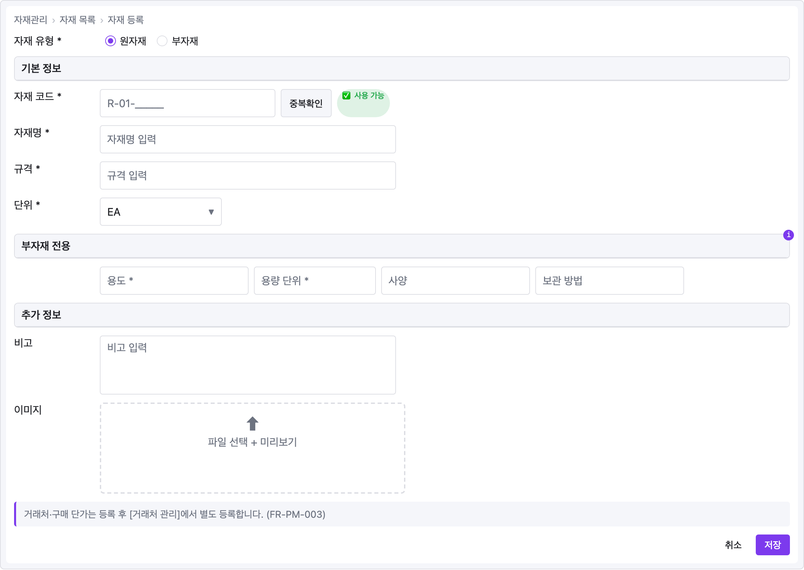

# 레시피 — 자재 등록

한국어 ERP 스타일 등록 폼 — 브레드크럼, 라디오 선택 유형, `panel` 로 묶은 여러 섹션, 4컬럼 조건부 블록, 파일 업로드, 정보 alert. 비영어 라벨이 그대로 작동함 (텍스트 렌더링은 `textContent` 이므로).

```ui-sketch
viewport: desktop
screen:
  - breadcrumb: { items: ["자재관리", "자재 목록", "자재 등록"] }

  - row:
      gap: 16
      align: center
      items:
        - text: { value: "자재 유형 *", w: 120 }
        - radio: { label: "원자재", selected: true }
        - radio: { label: "부자재", selected: false }

  - panel: { header: "기본 정보" }
  - row:
      gap: 8
      align: center
      items:
        - text: { value: "자재 코드 *", w: 120 }
        - input: { placeholder: "R-01-_____", w: 240 }
        - button: { label: "중복확인", variant: secondary }
        - badge: { label: "✅ 사용 가능", variant: success }
  - row:
      gap: 8
      align: center
      items:
        - text: { value: "자재명 *", w: 120 }
        - input: { placeholder: "자재명 입력", w: 420 }
  - row:
      gap: 8
      align: center
      items:
        - text: { value: "규격 *", w: 120 }
        - input: { placeholder: "규격 입력", w: 420 }
  - row:
      gap: 8
      align: center
      items:
        - text: { value: "단위 *", w: 120 }
        - select:
            value: "EA"
            options: ["m", "EA", "kg", "SET"]
            w: 160

  - panel:
      header: "부자재 전용"
      note: "자재 유형 = 부자재 일 때만 활성화"
  - row:
      gap: 8
      items:
        - text: { value: "", w: 120 }
        - input: { placeholder: "용도 *", w: 200 }
        - input: { placeholder: "용량 단위 *", w: 160 }
        - input: { placeholder: "사양", w: 200 }
        - input: { placeholder: "보관 방법", w: 200 }

  - panel: { header: "추가 정보" }
  - row:
      gap: 8
      align: start
      items:
        - text: { value: "비고", w: 120 }
        - textarea: { placeholder: "비고 입력", rows: 3, w: 420 }
  - row:
      gap: 8
      align: start
      items:
        - text: { value: "이미지", w: 120 }
        - file-upload: { label: "파일 선택 + 미리보기", w: 420, h: 100 }

  - alert:
      severity: info
      message: "거래처·구매 단가는 등록 후 [거래처 관리]에서 별도 등록합니다. (FR-PM-003)"

  - row:
      gap: 8
      items:
        - col: { flex: 1, items: [] }
        - button: { label: "취소", variant: ghost }
        - button: { label: "저장", variant: primary }
```



## 패턴 메모

이 레시피는 [YAML 레퍼런스의 정렬 관용구](../yaml-reference.md#정렬-관용구) 세 가지를 한 폼에 담고 있습니다:

1. **라벨 컬럼 보존** — "부자재 전용" row가 더미 `text { value: "", w: 120 }` 로 시작해서 위쪽 라벨 있는 row들과 입력 정렬 맞춤.
2. **버튼 우측 정렬** — 하단 row의 `col { flex: 1, items: [] }` flex 스페이서가 취소 / 저장을 우측 끝으로.
3. **`panel` 로 섹션 묶기** — 각 메인 섹션("기본 정보", "부자재 전용", "추가 정보")이 plain `heading` 대신 `panel` 헤더 바로 열려서 한눈에 시각 구조가 보임.

"부자재 전용" panel 의 `note` 가 UI 조건("자재 유형 = 부자재 일 때만 활성화")을 헤더 본문에 쑤셔넣지 않고 호버 툴팁으로 분리.
