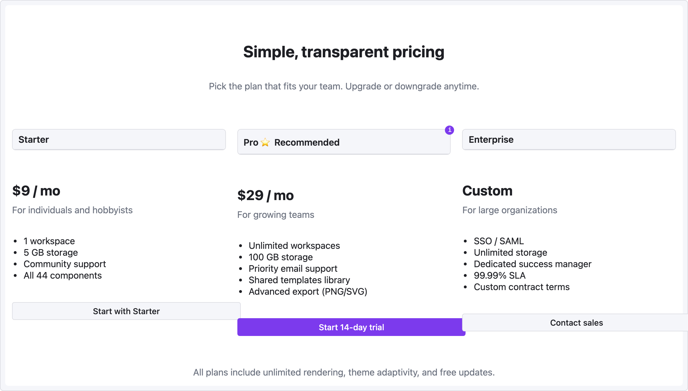

# 레시피 — 가격 페이지

3 티어 가격 레이아웃 — 추천 플랜 강조, 티어별 기능 목록, 각 티어 CTA 버튼.

```ui-sketch
viewport: desktop
screen:
  - spacer: { size: 40 }
  - heading:
      level: 1
      text: "Simple, transparent pricing"
      align: center
  - spacer: { size: 8 }
  - text:
      value: "Pick the plan that fits your team. Upgrade or downgrade anytime."
      tone: muted
      align: center
  - spacer: { size: 40 }
  - row:
      gap: 20
      items:
        - col:
            flex: 1
            items:
              - panel: { header: "Starter" }
              - container:
                  pad: 20
              - heading: { level: 2, text: "$9 / mo" }
              - text: { value: "For individuals and hobbyists", tone: muted }
              - spacer: { size: 16 }
              - list:
                  items:
                    - "1 workspace"
                    - "5 GB storage"
                    - "Community support"
                    - "All 44 components"
              - spacer: { size: 20 }
              - button: { label: "Start with Starter", variant: secondary, w: "100%" }
        - col:
            flex: 1
            items:
              - panel:
                  header: "Pro  ⭐ Recommended"
                  note: "Most popular — 80% of teams pick this"
              - container:
                  pad: 20
              - heading: { level: 2, text: "$29 / mo" }
              - text: { value: "For growing teams", tone: muted }
              - spacer: { size: 16 }
              - list:
                  items:
                    - "Unlimited workspaces"
                    - "100 GB storage"
                    - "Priority email support"
                    - "Shared templates library"
                    - "Advanced export (PNG/SVG)"
              - spacer: { size: 20 }
              - button: { label: "Start 14-day trial", variant: primary, w: "100%" }
        - col:
            flex: 1
            items:
              - panel: { header: "Enterprise" }
              - container:
                  pad: 20
              - heading: { level: 2, text: "Custom" }
              - text: { value: "For large organizations", tone: muted }
              - spacer: { size: 16 }
              - list:
                  items:
                    - "SSO / SAML"
                    - "Unlimited storage"
                    - "Dedicated success manager"
                    - "99.99% SLA"
                    - "Custom contract terms"
              - spacer: { size: 20 }
              - button: { label: "Contact sales", variant: secondary, w: "100%" }
  - spacer: { size: 28 }
  - text:
      value: "All plans include unlimited rendering, theme adaptivity, and free updates."
      tone: muted
      align: center
```



## 패턴 메모

- 각 티어가 `col { flex: 1 }` 이라 viewport 에 관계없이 너비가 균등 분할 — 프레임에 맞춰 확장.
- "Recommended" 티어는 panel 의 `note:` (ⓘ 툴팁) + 헤더 텍스트 안 ⭐ 이모지 — 별도 시각 variant 없이 선호 플랜 강조.
- CTA 버튼이 `w: "100%"` 라서 컬럼을 꽉 채우고 티어 간 수평 정렬.
- 하단 `tone: muted` 텍스트는 법적/안심 문구 — 가격 페이지 관행.
