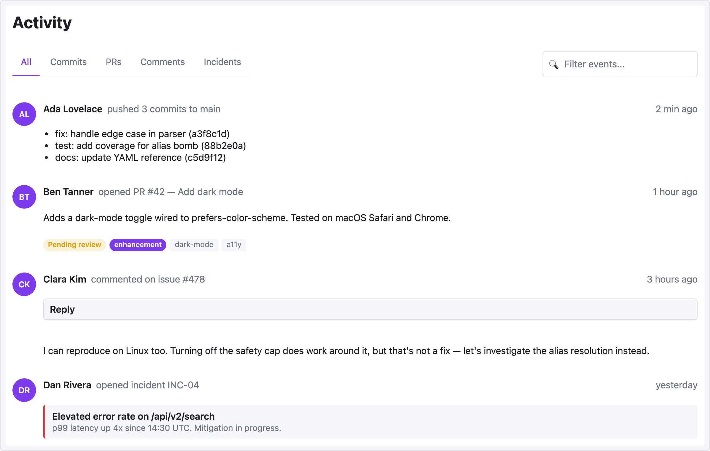

# Recipe — Activity Feed

Timeline of events (commits, PRs, comments, incidents) rendered as a vertical list of cards. Works for social feeds, audit logs, or project activity streams.

```ui-sketch
viewport: desktop
screen:
  - heading: { level: 1, text: "Activity" }
  - spacer: { size: 8 }
  - row:
      gap: 8
      align: center
      items:
        - tabs:
            items: ["All", "Commits", "PRs", "Comments", "Incidents"]
            active: 0
        - col: { flex: 1, items: [] }
        - search: { placeholder: "Filter events...", w: 240 }
  - spacer: { size: 20 }
  - col:
      items:
        - row:
            gap: 12
            align: start
            items:
              - avatar: { name: "Ada Lovelace", size: 40 }
              - col:
                  flex: 1
                  items:
                    - row:
                        gap: 8
                        align: center
                        items:
                          - text: { value: "Ada Lovelace", tone: strong }
                          - text: { value: "pushed 3 commits to main", tone: muted }
                          - col: { flex: 1, items: [] }
                          - text: { value: "2 min ago", tone: muted }
                    - spacer: { size: 4 }
                    - list:
                        items:
                          - "fix: handle edge case in parser (a3f8c1d)"
                          - "test: add coverage for alias bomb (88b2e0a)"
                          - "docs: update YAML reference (c5d9f12)"
        - spacer: { size: 20 }
        - row:
            gap: 12
            align: start
            items:
              - avatar: { name: "Ben Tanner", size: 40 }
              - col:
                  flex: 1
                  items:
                    - row:
                        gap: 8
                        align: center
                        items:
                          - text: { value: "Ben Tanner", tone: strong }
                          - text: { value: "opened PR #42 — Add dark mode", tone: muted }
                          - col: { flex: 1, items: [] }
                          - text: { value: "1 hour ago", tone: muted }
                    - spacer: { size: 6 }
                    - text:
                        value: "Adds a dark-mode toggle wired to prefers-color-scheme. Tested on macOS Safari and Chrome."
                    - spacer: { size: 8 }
                    - row:
                        gap: 6
                        items:
                          - badge: { label: "Pending review", variant: warning }
                          - badge: { label: "enhancement", variant: primary }
                          - tag: { label: "dark-mode" }
                          - tag: { label: "a11y" }
        - spacer: { size: 20 }
        - row:
            gap: 12
            align: start
            items:
              - avatar: { name: "Clara Kim", size: 40 }
              - col:
                  flex: 1
                  items:
                    - row:
                        gap: 8
                        align: center
                        items:
                          - text: { value: "Clara Kim", tone: strong }
                          - text: { value: "commented on issue #478", tone: muted }
                          - col: { flex: 1, items: [] }
                          - text: { value: "3 hours ago", tone: muted }
                    - spacer: { size: 6 }
                    - panel: { header: "Reply" }
                    - container: { pad: 12 }
                    - text:
                        value: "I can reproduce on Linux too. Turning off the safety cap does work around it, but that's not a fix — let's investigate the alias resolution instead."
        - spacer: { size: 20 }
        - row:
            gap: 12
            align: start
            items:
              - avatar: { name: "Dan Rivera", size: 40 }
              - col:
                  flex: 1
                  items:
                    - row:
                        gap: 8
                        align: center
                        items:
                          - text: { value: "Dan Rivera", tone: strong }
                          - text: { value: "opened incident INC-04", tone: muted }
                          - col: { flex: 1, items: [] }
                          - text: { value: "yesterday", tone: muted }
                    - spacer: { size: 6 }
                    - alert:
                        severity: error
                        title: "Elevated error rate on /api/v2/search"
                        message: "p99 latency up 4x since 14:30 UTC. Mitigation in progress."
```



## Pattern notes

- **Event row skeleton** — avatar on the left, main content in a flex-grow column. Header row inside has name + verb + timestamp split left/right with a flex spacer.
- **Mixed content per entry** — each event can show different child components (commit list, text blurb with badges, embedded panel for comment, or an alert for an incident). The outer row-col shape is identical.
- **Timestamps aligned right** with `col { flex: 1, items: [] }` spacer — scan-friendly.
- In a real app, this would be rendered by a component map keyed on event type. At mid-fi level, typing each event out is fine for a representative screen.
