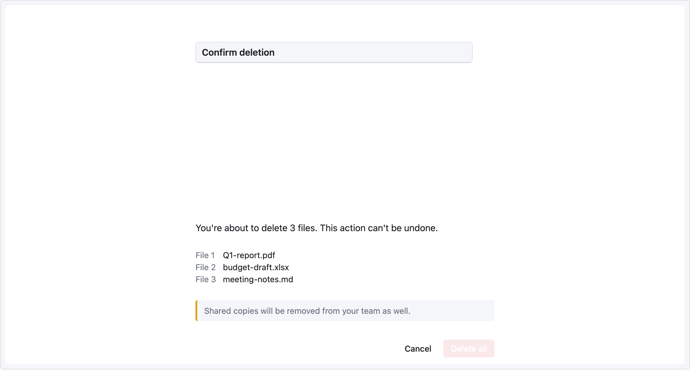

# Recipe — Confirmation Modal

Irreversible action (delete, cancel, revoke) needs a two-step confirmation. Keep the scope clear and the destructive button visually distinct.

```ui-sketch
viewport: desktop
screen:
  - spacer: { size: 40 }
  - row:
      items:
        - col: { flex: 1, items: [] }
        - col:
            flex: 0
            items:
              - panel:
                  header: "Confirm deletion"
                  w: 480
              - container:
                  pad: 20
                  w: 480
                  h: 220
              - text:
                  value: "You're about to delete 3 files. This action can't be undone."
              - spacer: { size: 12 }
              - kv-list:
                  items:
                    - ["File 1", "Q1-report.pdf"]
                    - ["File 2", "budget-draft.xlsx"]
                    - ["File 3", "meeting-notes.md"]
              - spacer: { size: 12 }
              - alert:
                  severity: warn
                  message: "Shared copies will be removed from your team as well."
              - spacer: { size: 16 }
              - row:
                  gap: 8
                  items:
                    - col: { flex: 1, items: [] }
                    - button: { label: "Cancel", variant: ghost }
                    - button: { label: "Delete all", variant: danger }
        - col: { flex: 1, items: [] }
```



## Pattern notes

- `col { flex: 0 }` with fixed-width children (`w: 480`) keeps the modal a consistent 480px regardless of viewport — wrapped by two `flex: 1` gutters for horizontal centering.
- **Danger variant** on the primary action + **ghost variant** on cancel is the convention: no accidental confirms.
- `alert` above the actions surfaces secondary consequences (team-wide removal) that might not be obvious from the title alone.
- In production this would be an overlay, but for a mid-fi sketch rendering it inline is sufficient.
