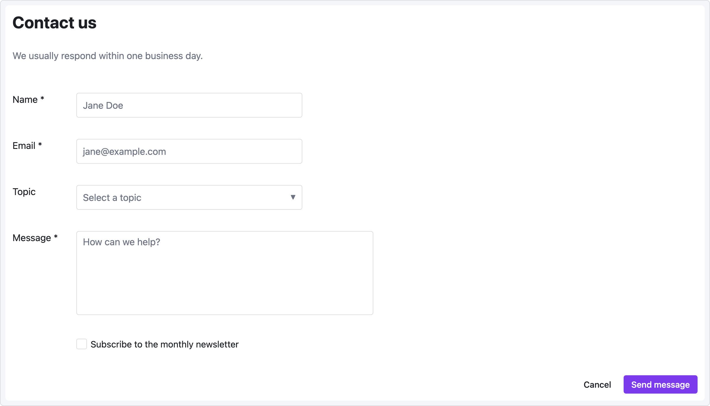

# Recipe — Contact Form

Labeled form with aligned input columns, a select dropdown, and a multi-line message field. Demonstrates the standard `text { w: N }` + input pattern.

```ui-sketch
viewport: desktop
screen:
  - heading: { level: 1, text: "Contact us" }
  - spacer: { size: 4 }
  - text:
      value: "We usually respond within one business day."
      tone: muted
  - spacer: { size: 28 }
  - row:
      gap: 8
      align: center
      items:
        - text: { value: "Name *", w: 100 }
        - input: { placeholder: "Jane Doe", w: 360 }
  - spacer: { size: 12 }
  - row:
      gap: 8
      align: center
      items:
        - text: { value: "Email *", w: 100 }
        - input: { placeholder: "jane@example.com", w: 360 }
  - spacer: { size: 12 }
  - row:
      gap: 8
      align: center
      items:
        - text: { value: "Topic", w: 100 }
        - select:
            placeholder: "Select a topic"
            options: ["General question", "Billing issue", "Bug report", "Feature request"]
            w: 360
  - spacer: { size: 12 }
  - row:
      gap: 8
      align: start
      items:
        - text: { value: "Message *", w: 100 }
        - textarea:
            placeholder: "How can we help?"
            rows: 6
            w: 480
  - spacer: { size: 16 }
  - row:
      gap: 8
      align: center
      items:
        - text: { value: "", w: 100 }
        - checkbox:
            label: "Subscribe to the monthly newsletter"
            checked: false
  - spacer: { size: 20 }
  - row:
      gap: 8
      items:
        - col: { flex: 1, items: [] }
        - button: { label: "Cancel", variant: ghost }
        - button: { label: "Send message", variant: primary }
```



## Pattern notes

- All labels use `w: 100` — pick a width that fits your longest label (here "Message *") and reuse it everywhere.
- The checkbox row still includes a dummy `text { value: "", w: 100 }` so the checkbox aligns with the inputs above.
- `align: center` on most rows vertically centers the label with a single-line input; `align: start` on the textarea row keeps the label top-aligned.
- Fields are marked required with `*` in the label — no built-in required-asterisk styling.
