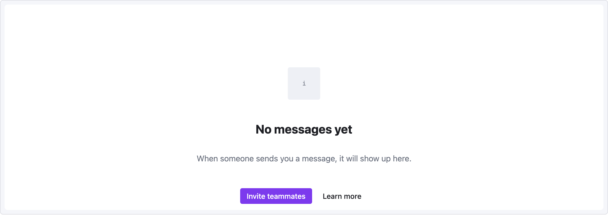

# Recipe — Empty State

Placeholder screen shown when a list, inbox, or folder has no content yet. Should be friendly, explanatory, and offer a next action.

```ui-sketch
viewport: desktop
screen:
  - spacer: { size: 100 }
  - row:
      items:
        - col: { flex: 1, items: [] }
        - icon: { name: "inbox", size: 64 }
        - col: { flex: 1, items: [] }
  - spacer: { size: 20 }
  - heading:
      level: 2
      text: "No messages yet"
      align: center
  - spacer: { size: 8 }
  - text:
      value: "When someone sends you a message, it will show up here."
      tone: muted
      align: center
  - spacer: { size: 24 }
  - row:
      gap: 8
      items:
        - col: { flex: 1, items: [] }
        - button: { label: "Invite teammates", variant: primary }
        - button: { label: "Learn more", variant: ghost }
        - col: { flex: 1, items: [] }
```



## Pattern notes

- Large top spacer (100px) pushes the content down from the viewport edge to mimic a "balanced" empty state.
- Icon is wrapped in its own flex-centered row because `align: center` on a standalone icon element only affects cross-axis within its direct flex parent, which is the main column (vertical).
- The two-button cluster uses the centered-with-flex-spacer idiom from [YAML Reference → Alignment idioms](../yaml-reference.md#alignment-idioms).
