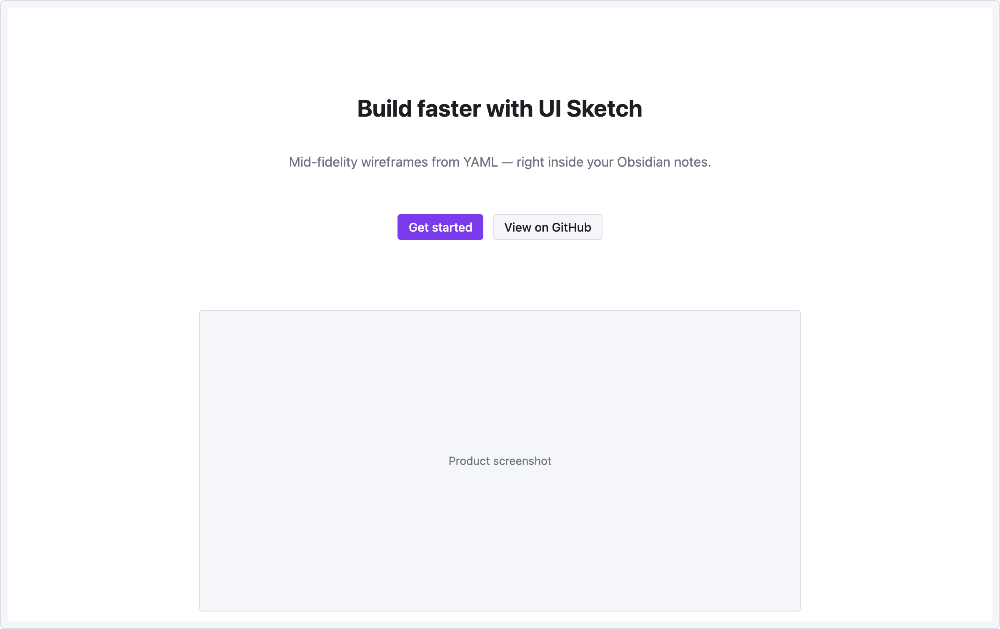

# Recipe — Landing Hero

Centered headline, tagline, and two call-to-action buttons — the standard hero section of a marketing page.

```ui-sketch
viewport: desktop
screen:
  - spacer: { size: 80 }
  - heading:
      level: 1
      text: "Build faster with UI Sketch"
      align: center
  - spacer: { size: 12 }
  - text:
      value: "Mid-fidelity wireframes from YAML — right inside your Obsidian notes."
      tone: muted
      align: center
  - spacer: { size: 28 }
  - row:
      gap: 12
      items:
        - col: { flex: 1, items: [] }
        - button: { label: "Get started", variant: primary }
        - button: { label: "View on GitHub", variant: secondary }
        - col: { flex: 1, items: [] }
  - spacer: { size: 60 }
  - row:
      items:
        - col: { flex: 1, items: [] }
        - image: { src: "hero.png", alt: "Product screenshot", w: 720, h: 360 }
        - col: { flex: 1, items: [] }
```



## Pattern notes

- `align: center` on text + heading centers them within the column.
- Two-sided `col { flex: 1, items: [] }` wrappers around the button row form a centered cluster without a fixed width.
- The image block is a placeholder — `src` shows as hover metadata but is not fetched.
