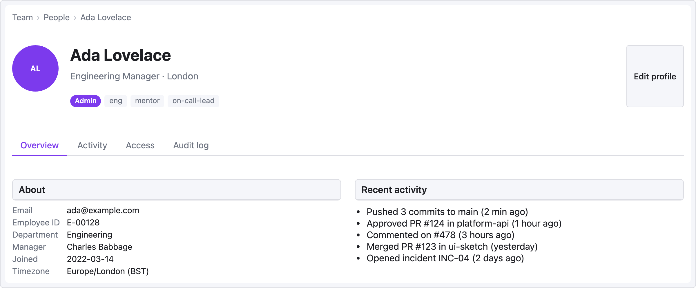

# Recipe — Profile Page

User profile with an avatar header, tabs, and a details panel. Common pattern for "account settings" or social-style profile views.

```ui-sketch
viewport: desktop
screen:
  - breadcrumb: { items: ["Team", "People", "Ada Lovelace"] }
  - spacer: { size: 16 }
  - row:
      gap: 20
      align: center
      items:
        - avatar: { name: "Ada Lovelace", size: 80 }
        - col:
            flex: 1
            items:
              - heading: { level: 1, text: "Ada Lovelace" }
              - text: { value: "Engineering Manager · London", tone: muted }
              - spacer: { size: 6 }
              - row:
                  gap: 6
                  items:
                    - badge: { label: "Admin", variant: primary }
                    - tag: { label: "eng" }
                    - tag: { label: "mentor" }
                    - tag: { label: "on-call-lead" }
        - button: { label: "Edit profile", variant: secondary }
  - spacer: { size: 24 }
  - tabs:
      items: ["Overview", "Activity", "Access", "Audit log"]
      active: 0
  - spacer: { size: 16 }
  - row:
      gap: 24
      items:
        - col:
            flex: 1
            items:
              - panel: { header: "About" }
              - kv-list:
                  pad: 12
                  items:
                    - ["Email",        "ada@example.com"]
                    - ["Employee ID",  "E-00128"]
                    - ["Department",   "Engineering"]
                    - ["Manager",      "Charles Babbage"]
                    - ["Joined",       "2022-03-14"]
                    - ["Timezone",     "Europe/London (BST)"]
        - col:
            flex: 1
            items:
              - panel: { header: "Recent activity" }
              - list:
                  pad: 12
                  items:
                    - "Pushed 3 commits to main (2 min ago)"
                    - "Approved PR #124 in platform-api (1 hour ago)"
                    - "Commented on #478 (3 hours ago)"
                    - "Merged PR #123 in ui-sketch (yesterday)"
                    - "Opened incident INC-04 (2 days ago)"
```



## Pattern notes

- Avatar + identity cluster uses a `row` with `align: center` to vertically balance the 80px avatar with the heading + subtitle column.
- The rightmost "Edit profile" button lands at the row's end because the middle `col { flex: 1 }` absorbs space — no explicit flex spacer needed when there's already a growing column between items.
- Two `col { flex: 1 }`s under the tabs split the lower area 50/50 for parallel content (About / Recent activity).
