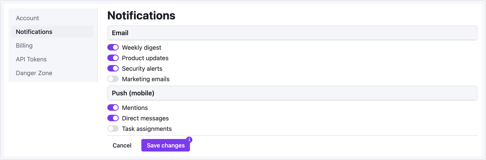

# Recipe — Settings Panel

Two-column settings screen: left sidebar of categories, right pane of settings. Uses `panel` with grouped controls.

```ui-sketch
viewport: desktop
screen:
  - row:
      gap: 24
      items:
        - col:
            flex: 0
            items:
              - sidebar:
                  w: 220
                  items: ["Account", "Notifications", "Billing", "API Tokens", "Danger Zone"]
                  active: "Notifications"
        - col:
            flex: 1
            items:
              - heading: { level: 1, text: "Notifications", pad: 24 }
              - panel:
                  header: "Email"
                  pad: 24
              - row:
                  gap: 24
                  pad: 24
                  items:
                    - col:
                        flex: 1
                        items:
                          - toggle: { label: "Weekly digest",     on: true }
                          - toggle: { label: "Product updates",   on: true }
                          - toggle: { label: "Security alerts",   on: true }
                          - toggle: { label: "Marketing emails",  on: false }
              - panel:
                  header: "Push (mobile)"
                  pad: 24
              - row:
                  gap: 24
                  pad: 24
                  items:
                    - col:
                        flex: 1
                        items:
                          - toggle: { label: "Mentions",          on: true }
                          - toggle: { label: "Direct messages",   on: true }
                          - toggle: { label: "Task assignments",  on: false }
              - divider: {}
              - row:
                  gap: 12
                  pad: 24
                  items:
                    - button: { label: "Cancel",      variant: ghost }
                    - button: { label: "Save changes", variant: primary, note: "Writes to settings.json" }
```



## Pattern notes

- **`pad:` on nested containers** gives you consistent 24px page gutters without hardcoding widths.
- **`col` with `flex: 0`** lets the sidebar keep its fixed 220px width — flex won't stretch it.
- **`note:`** on the Save button documents behavior for the spec reader without adding visual noise.

## Variation: summary + action buttons

Add a `kv-list` at the top for the current plan summary:

```yaml
- panel:
    header: "Current plan"
- kv-list:
    pad: 24
    items:
      - ["Plan",          "Pro"]
      - ["Billing cycle", "Monthly"]
      - ["Next charge",   "2026-05-01"]
      - ["Amount",        "$19.00"]
- row:
    gap: 12
    pad: 24
    items:
      - button: { label: "Change plan",    variant: secondary }
      - button: { label: "Cancel subscription", variant: danger, note: "Irreversible" }
```
