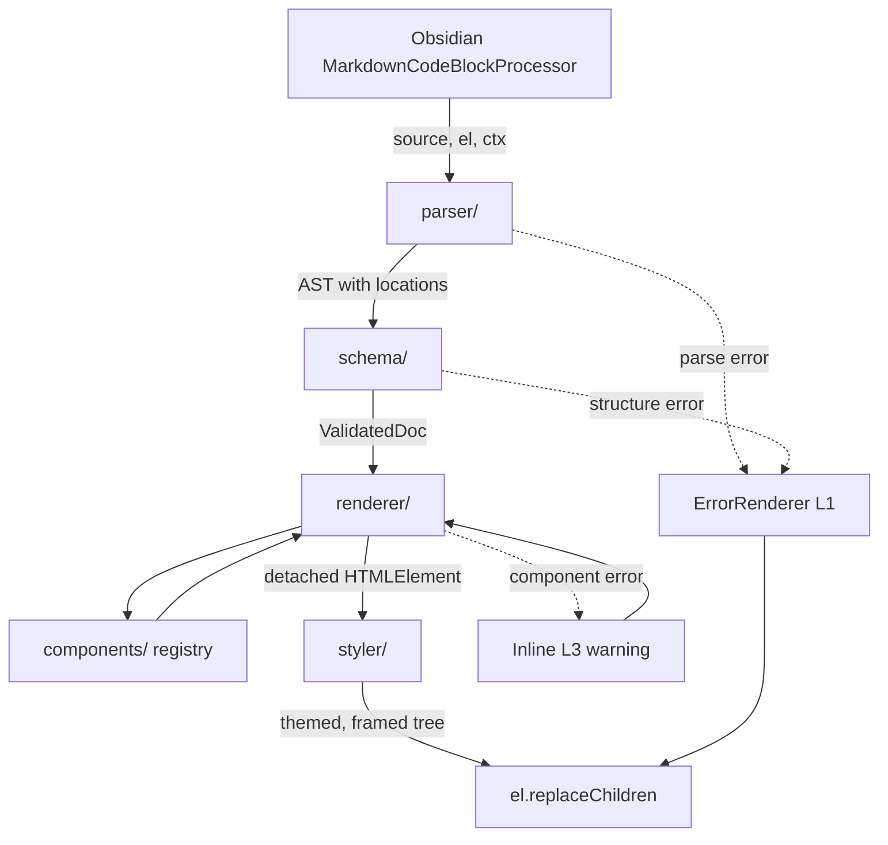
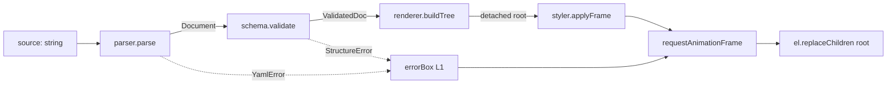

# UI Sketch — Obsidian Community Plugin Design

- **Status**: Draft (design approved 2026-04-24)
- **Owner**: jikwangkim
- **Target**: Obsidian Community Plugins

---

## 1. Overview

A community plugin that renders **mid-fidelity web UI wireframes** inside Obsidian notes. Users write a compact YAML description inside a `ui-sketch` code block; the plugin renders it as a clean, theme-adaptive preview in Reading view and Live Preview.

**Problem it solves.** Today, users draw UI sketches inline with ASCII art. This is painful to author (indentation is fragile), hard to read (structure must be inferred), and impossible to keep consistent as the design evolves. Structured YAML + a rendered preview solves all three.

**Core value proposition.**
- Author a screen in ~10–30 lines of YAML vs. dozens of error-prone ASCII characters.
- Stays in the note (no context switch to Figma/Excalidraw for quick sketches).
- Blends into any Obsidian theme automatically.

---

## 2. Goals / Non-Goals

### Goals (v1)
- Render a single screen per code block from YAML input.
- Support ~40 common web UI components at a mid-fi level (Balsamiq-ish clarity, not pixel-perfect).
- Two layout models: flex-style row/col nesting (primary), and CSS-grid-style named areas (optional, root-level only).
- Theme adaptation via Obsidian CSS variables — no manual theme switching logic.
- Viewport presets (`desktop`, `tablet`, `mobile`, `custom`).
- Inline design annotations via `note:` property (hover tooltip).
- Friendly, position-aware error reporting with partial rendering where possible.

### Non-Goals (deferred to v2+)
- Image/SVG/PDF export.
- Bidirectional editing (clicking preview to mutate YAML).
- Multi-screen storyboards with connectors.
- Reusable component definitions (partials/variables beyond YAML anchors).
- Linking components to Obsidian notes (`link: "[[other]]"`).
- High-fidelity theming (brand colors, custom fonts, image support beyond placeholders).
- Pixel-precise visual regression testing.

### Success criteria (post-launch, first month)
- 100+ installs after public listing.
- Zero critical bugs.
- At least one of the top-3 v2 feature requests clearly identified from user feedback.

---

## 3. User Scenarios

1. **Spec writer**: While drafting a feature doc in Obsidian, the PM sketches the target screen in YAML next to the prose. Reviewers open the note and immediately see the intended layout.
2. **Self-planning developer**: Before coding, a developer drafts the UI as YAML in a scratch note, iterates on structure, and uses it as a checklist during implementation.
3. **Team async review**: A designer drops a wireframe YAML into a shared vault. Reviewers add comments as Obsidian text around it. Changes to the wireframe become a simple YAML diff.

---

## 4. Architecture

### High-level flow



### Module boundaries

| Module | Responsibility | External deps |
|---|---|---|
| `parser/` | YAML string → AST; preserve line/col on every node | `js-yaml` |
| `schema/` | Validate & normalize AST using per-component zod schemas; produce `ValidatedDoc`; generate typo suggestions | `zod` |
| `components/` | One file per component type; exports a pure `render(props, ctx) → HTMLElement`; no knowledge of parser/schema | none (DOM only) |
| `renderer/` | Walks `ValidatedDoc`, dispatches to `components/` via `ComponentRegistry`, applies viewport frame | parser, schema, components |
| `styler/` | Applies frame (viewport) and theme class; all actual styling via `styles.css` using Obsidian CSS variables | none |
| `main.ts` | Plugin lifecycle, registers code block processor, settings tab | Obsidian API |

Each module is independently testable. New components are added by creating `components/<name>.ts` and registering `{ render, schema }` — no core changes.

### Tech stack

- **Language**: TypeScript (standard Obsidian plugin template).
- **Bundler**: `esbuild`.
- **Runtime deps**: `js-yaml`, `zod`, `sanitize-html` (for `raw:`). Icons via `lucide` (already bundled in Obsidian).
- **Package manager**: `yarn`.

### Plugin artifacts

A release produces three files uploaded to the GitHub release: `main.js`, `styles.css`, `manifest.json`.

---

## 5. YAML Schema

### Top-level document

```yaml
viewport: desktop | tablet | mobile | custom   # default: desktop
width: 375                                      # only if viewport=custom
height: 640
theme: adaptive                                 # v1: only "adaptive"
background: default | muted | transparent       # default: default
screen:                                         # required, non-empty
  - ...                                         # row/col/grid at root
```

Viewport presets:

| Preset | Width |
|---|---|
| `desktop` | 1200 px (max-width 100%) |
| `tablet` | 768 px |
| `mobile` | 375 px |
| `custom` | `width`/`height` required |

### Layout models

**A. Flex-style row/col nesting (primary)**

```yaml
screen:
  - row:
      gap: 12
      items:
        - col: { flex: 1, items: [ ... ] }
        - col: { flex: 3, items: [ ... ] }
```

**B. Named-area grid (root-level only, optional)**

```yaml
screen:
  grid:
    areas:
      - "nav  nav  nav"
      - "side main main"
      - "side foot foot"
    cols: "180px 1fr 1fr"
    rows: "56px 1fr 48px"
  map:
    nav:  { navbar: { brand: "MyApp" } }
    side: { sidebar: { items: ["Home", "Docs"] } }
    main: { card: { title: "Welcome" } }
    foot: { text: "© 2026" }
```

A and B are **mutually exclusive at the root**. Inside B's `map` values, nested content uses A (row/col) as normal.

### Common component properties

Every component accepts these base props in addition to its type-specific props:

| Prop | Type | Purpose |
|---|---|---|
| `id` | string | Optional identifier for CSS hooks and future bidirectional features |
| `w`, `h` | number \| string | Explicit size; coexists with flex |
| `align` | `start` \| `center` \| `end` | Self-alignment within parent |
| `pad` | number \| string | CSS padding shorthand |
| `note` | string | Design annotation; renders as ⓘ hover tooltip |
| `muted` | boolean | Reduced-emphasis rendering (de-activated look) |

### Example component spec

```yaml
button:
  label: "로그인"
  variant: primary | secondary | ghost | danger
  icon: lock              # lucide icon name
  # plus any common prop (note, muted, w, h, align, pad, id)
```

---

## 6. Component Catalog

MVP ships ~40 components across 8 categories plus one escape-hatch component. Each renders as a **minimal HTML/CSS box** — no real behavior, just a visual representation.

| Category | Components |
|---|---|
| Layout structure | `card`, `panel`, `divider`, `spacer`, `container` |
| Navigation | `navbar`, `sidebar`, `tabs`, `breadcrumb`, `pagination`, `stepper` |
| Basic input | `button`, `input`, `textarea`, `select`, `checkbox`, `radio` |
| Advanced input | `toggle`, `slider`, `date-picker`, `file-upload`, `search` |
| Display | `heading`, `text`, `image`, `icon`, `avatar`, `badge`, `tag`, `kbd` |
| Feedback | `alert`, `progress`, `toast`, `modal`, `skeleton` |
| Data | `table`, `list`, `tree`, `kv-list` |
| Placeholder | `chart`, `map`, `video`, `placeholder` |
| Escape hatch | `raw` (innerHTML, piped through `sanitize-html`) |

### Extending the catalog

Adding a new component type:
1. Create `components/<name>.ts` exporting `{ schema, render }`.
2. Register in `components/registry.ts`.
3. Add fixtures to `schema/tests/` and a snapshot entry in `renderer/tests/`.

No changes to `parser/`, `renderer/`, or `main.ts` required.

---

## 7. Rendering Lifecycle

### Entry point

```ts
this.registerMarkdownCodeBlockProcessor("ui-sketch",
  async (source, el, ctx) => render(source, el, ctx, this.settings)
);
```

Obsidian invokes the callback each time the block appears on-screen. The plugin treats each call as a **single-shot pure transform**.

### Per-call pipeline



**Invariants:**
- Each stage is a pure function — same input, same output, no side effects until the final `replaceChildren`.
- DOM is committed exactly once per call, inside `requestAnimationFrame`, to avoid layout thrash.
- No persistent state between calls.

### Viewport frame

The render tree is wrapped:

```html
<div class="ui-sketch-frame" data-viewport="mobile" style="width: 375px; max-width: 100%;">
  <div class="ui-sketch-root"> ... </div>
</div>
```

Parent note overflow is handled by `max-width: 100%` — a mobile frame in a narrow pane shrinks gracefully.

### Annotation (`note:`)

- Every component's wrapper gets `title="<note>"` + a small ⓘ overlay (CSS `::after`).
- No custom tooltip code; browser-native `title` works in both Reading view and Live Preview.

### Theme adaptation

All component CSS references Obsidian CSS variables:
`--background-primary`, `--background-secondary`, `--background-modifier-border`, `--text-normal`, `--text-muted`, `--interactive-accent`, `--interactive-accent-hover`, `--radius-m`.

Theme changes propagate automatically — no event subscription required.

### Settings tab (4 options)

| Setting | Default | Notes |
|---|---|---|
| Default viewport | `desktop` | Used when block has no `viewport:` |
| Default theme | `adaptive` | v1 has only `adaptive`; structure reserved for future |
| Compact mode | `off` | Scales all spacing/font ×0.875 |
| Verbose logging | `off` | Enables `console.debug` traces |

---

## 8. Error Handling & UX

### Four error levels

| Level | Trigger | Result | Recoverable? |
|---|---|---|---|
| L1 | YAML parse failure | Whole block replaced by error box | no |
| L2 | Document-structure error (missing `screen:`, wrong root type) | Whole block replaced by error box | no |
| L3 | Component-level error (missing required prop, unknown type) | Inline warning at that component's position; rest of tree renders | yes |
| L4 | Empty block or empty `screen:` | Dotted placeholder with a starter example | yes |

### Error box content

All error boxes include:
- Error level badge (❌ / ⚠).
- Problem summary (1 line).
- Source context (±2 lines around the offending location, when available).
- Actionable hint — how to fix or where to look.

### Location tracking

- `js-yaml` parse results carry `startMark`/`endMark`. We attach `__loc: { line, col }` to every AST node.
- `schema/` preserves `__loc` on validation errors.
- In the error UI, line numbers are offset by `ctx.getSectionInfo(el).lineStart` to give absolute note-level line numbers.

### Unknown component with suggestions

If an unrecognized type has a known type within Levenshtein distance ≤ 2, the L3 message offers a "Did you mean?" hint. Otherwise it shows where to find the catalog.

### Safety guards

| Concern | Mitigation |
|---|---|
| YAML anchor/alias bomb | `maxAliasCount: 200` (js-yaml option) |
| Deep tree stack overflow | Render depth ≥ 32 → L3 warning, children truncated |
| Node count explosion | > 5000 nodes → L2 error; ask user to split |
| Script injection via `raw:` | Always run through `sanitize-html`; no opt-out |

### Developer logging

- Normal path: no console output.
- L1–L3 errors: `console.debug("[ui-sketch] ...", details)` only (to avoid flooding the console).
- "Verbose logging" setting enables additional trace output for development.

---

## 9. Testing Strategy

### Stack

- **Vitest** as the test runner (fast, TS-native, esbuild-friendly).
- **happy-dom** for DOM assertions (lighter than jsdom).
- **Snapshot tests** for `renderer/` output on representative fixtures.
- Thin fake for `MarkdownPostProcessorContext` (only `getSectionInfo` is used).

### Coverage targets

| Layer | Strategy | Target |
|---|---|---|
| `parser/` | Unit tests on valid + malformed YAML; location preservation | ≥ 85% |
| `schema/` | Each component's schema validated (positive + negative); typo suggestion; unknown type | ≥ 85% |
| `components/` | Smoke test per type — one render call, assert key class/attrs | 1 per component (40 total) |
| `renderer/` | 12 representative full-YAML fixtures → snapshot | — |

### What we do **not** test in v1

- Pixel-level visual regression (deferred; theme-dependent rendering makes this noisy).
- Obsidian runtime integration end-to-end (manual verification via a dev vault).

### Manual verification

An `examples/` folder contains 5+ sample wireframes (login, dashboard, settings, data table, mobile detail). Developer runs `yarn build`, copies artifacts into a dev vault's `.obsidian/plugins/ui-sketch/`, and eyeballs each example across light and dark themes.

---

## 10. Release Plan

### Stage 0 — Bootstrap
- Initialize repo from `obsidianmd/obsidian-sample-plugin` template.
- Configure `yarn`, `vitest`, `eslint`, `prettier`.
- CI: GitHub Actions runs `yarn install && yarn test && yarn build` on PR and main push.

### Stage 1 — v0.1 (Internal)
- All four modules implemented, ~10 components working.
- Manual install into developer's own vault.
- Shake out schema ergonomics with ~10 sample notes.

### Stage 2 — v0.5 (BRAT beta)
- All 40 components + error UX + settings tab.
- GitHub release automation: tag push → upload `main.js`, `styles.css`, `manifest.json`.
- Announce via BRAT for early adopters.
- Collect feedback via GitHub Issues; add "Copy debug info" button in settings.

### Stage 3 — v1.0 (Community Plugins)
- README with 2 screenshots + install + minimal example.
- `docs/components.md` auto-generated from schema via a build script (single source of truth).
- `docs/examples/` with 5 canonical wireframes.
- `CHANGELOG.md` in keep-a-changelog format.
- PR to `obsidianmd/obsidian-releases`; pass review.

### Versioning

- Semantic versioning (`MAJOR.MINOR.PATCH`).
- Breaking YAML schema changes only at MAJOR; schema additions are MINOR.
- `manifest.json` `minAppVersion` tracked explicitly; reviewed before each release.

---

## 11. Open Questions

None at the close of design. Any remaining decisions are implementation-level and belong in the implementation plan.

---

## 12. Appendix — Worked Example

```yaml
viewport: desktop
screen:
  - row:
      items:
        - navbar: { brand: "DocHub", items: ["Home", "Docs", "Pricing"] }
  - row:
      gap: 16
      items:
        - col:
            flex: 1
            items:
              - sidebar: { items: ["Getting Started", "API", "FAQ"] }
        - col:
            flex: 3
            items:
              - heading: { level: 1, text: "Welcome back" }
              - row:
                  gap: 12
                  items:
                    - card: { title: "Tasks", body: "12 open" }
                    - card: { title: "Docs",  body: "3 drafts" }
              - button:
                  label: "New document"
                  variant: primary
                  icon: plus
                  note: "클릭 시 /documents/new 로 이동"
```

Rendered output: a desktop-width frame with a top navbar, a left sidebar listing three items, a main area with a heading, a two-card summary row, and a primary button with a hover tooltip on the note.
